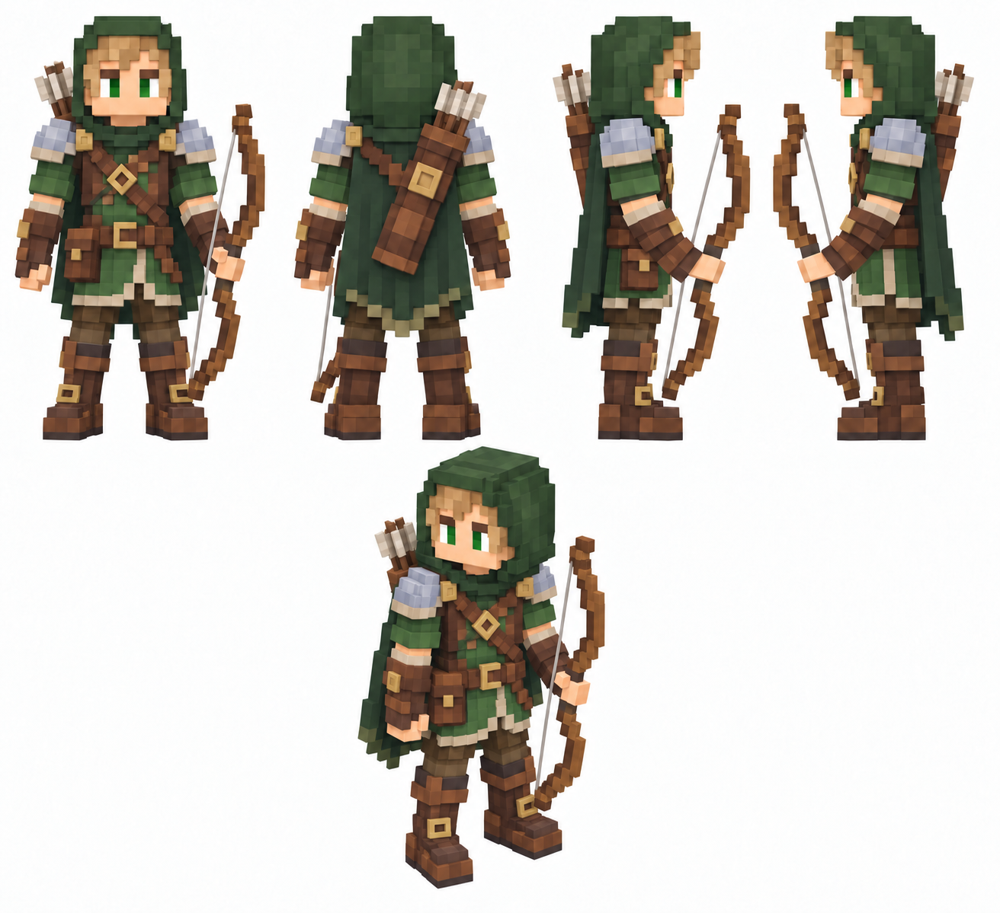

# Лучник

Статус: **candidate**, художественный референс для проверки пользователем.

Фэнтези-Лучник: крупные воксели, зелёный капюшон, деревянный лук в левой руке и колчан на спине. Пять видов на чистом фоне.

Страница CubeSiege: [Лучник](https://chatgpt.com/space/page_53022a18f3288191a0387b6921e42ed8).

Происхождение и параметры: `provenance.json`; точный промпт: `prompt.txt`; наблюдения: `inspection.json`.
