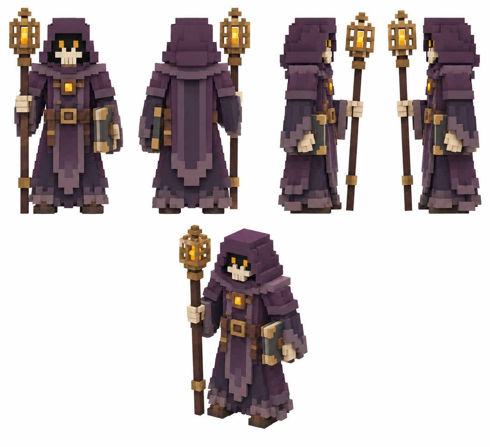

# Пепельный оракул

Статус: **candidate**, художественный референс для проверки пользователем.

Пять ракурсов босса в крупной воксельной стилистике; развитие существующего силуэта и палитры.

Страница CubeSiege: [Пепельный оракул](https://chatgpt.com/space/page_d339f2473ed48191b348d468d10ea015).

Происхождение и параметры: `provenance.json`; точный промпт: `prompt.txt`; наблюдения: `inspection.json`.
