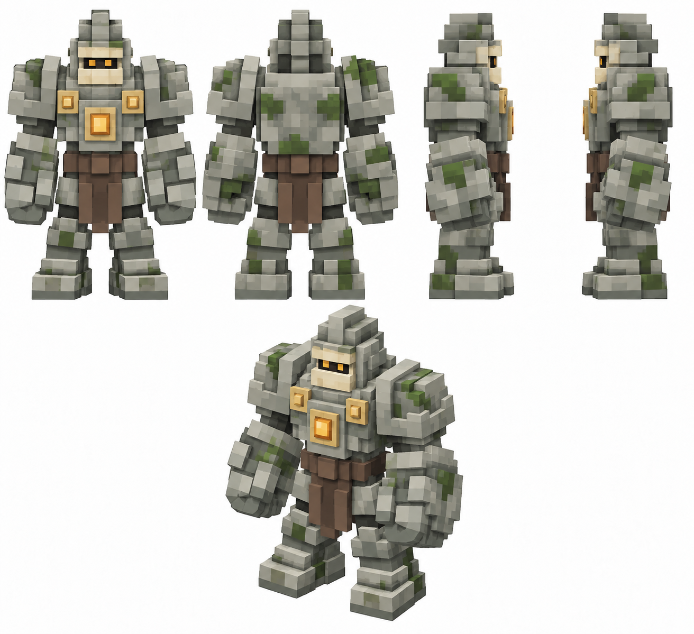

# Страж кургана

Статус: **candidate**, художественный референс для проверки пользователем.

Пять ракурсов босса в крупной воксельной стилистике; развитие существующего силуэта и палитры.

Страница CubeSiege: [Страж кургана](https://chatgpt.com/space/page_ac6de68b0c28819193cb8bb93156c5bb).

Происхождение и параметры: `provenance.json`; точный промпт: `prompt.txt`; наблюдения: `inspection.json`.
