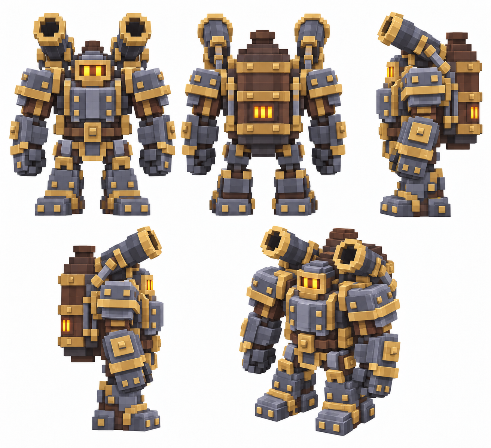

# Мортирный колосс

Статус: **candidate**, художественный референс для проверки пользователем.

Пять ракурсов босса в крупной воксельной стилистике; развитие существующего силуэта и палитры.

Страница CubeSiege: [Мортирный колосс](https://chatgpt.com/space/page_5a1773fa06188191a471c45b6871b2cd).

Происхождение и параметры: `provenance.json`; точный промпт: `prompt.txt`; наблюдения: `inspection.json`.
