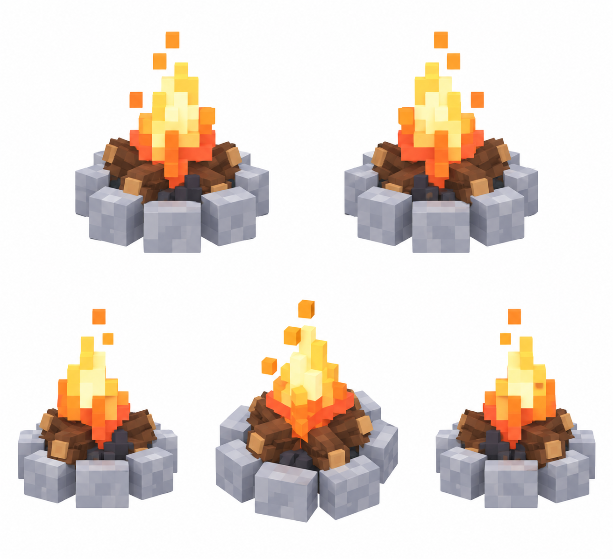

# Костёр

Статус: **candidate**, художественный референс для проверки пользователем.

Пять ракурсов одной существующей постройки. Крупные воксели; без ландшафта, внешней подставки и подписей.

Страница CubeSiege: [Костёр](https://chatgpt.com/space/page_997d649cdc9081919a2a963384109169).

Происхождение и параметры: `provenance.json`; точный промпт: `prompt.txt`; наблюдения: `inspection.json`.
