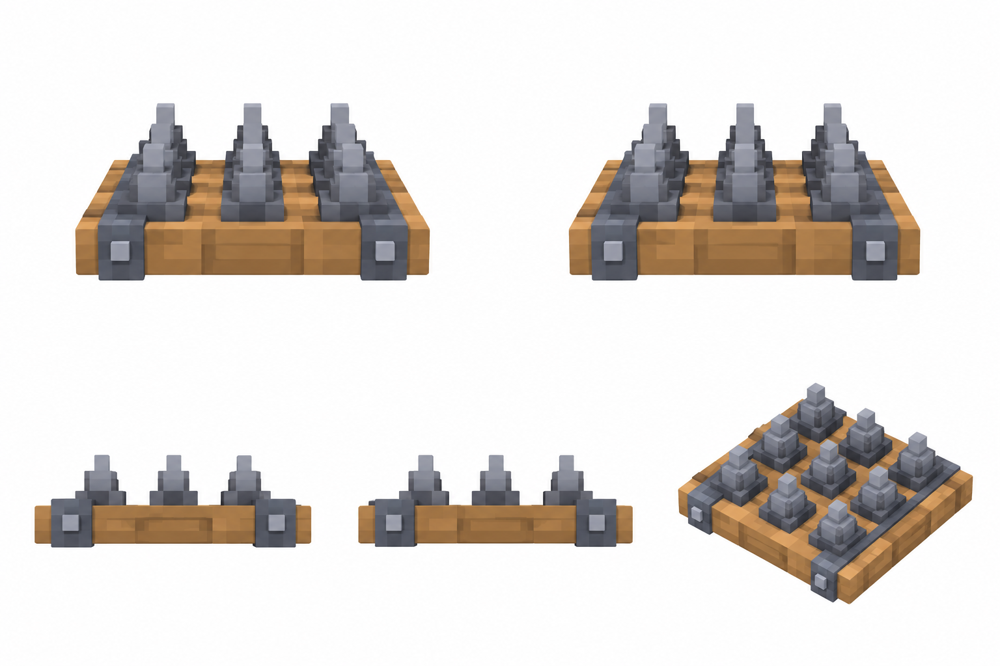

# Напольные шипы

Статус: **candidate**, художественный референс для проверки пользователем.

Пять ракурсов одной существующей постройки. Крупные воксели; без ландшафта, внешней подставки и подписей.

Страница CubeSiege: [Напольные шипы](https://chatgpt.com/space/page_3bbaeba2efa881918e16b9cbd1fa3618).

Происхождение и параметры: `provenance.json`; точный промпт: `prompt.txt`; наблюдения: `inspection.json`.
