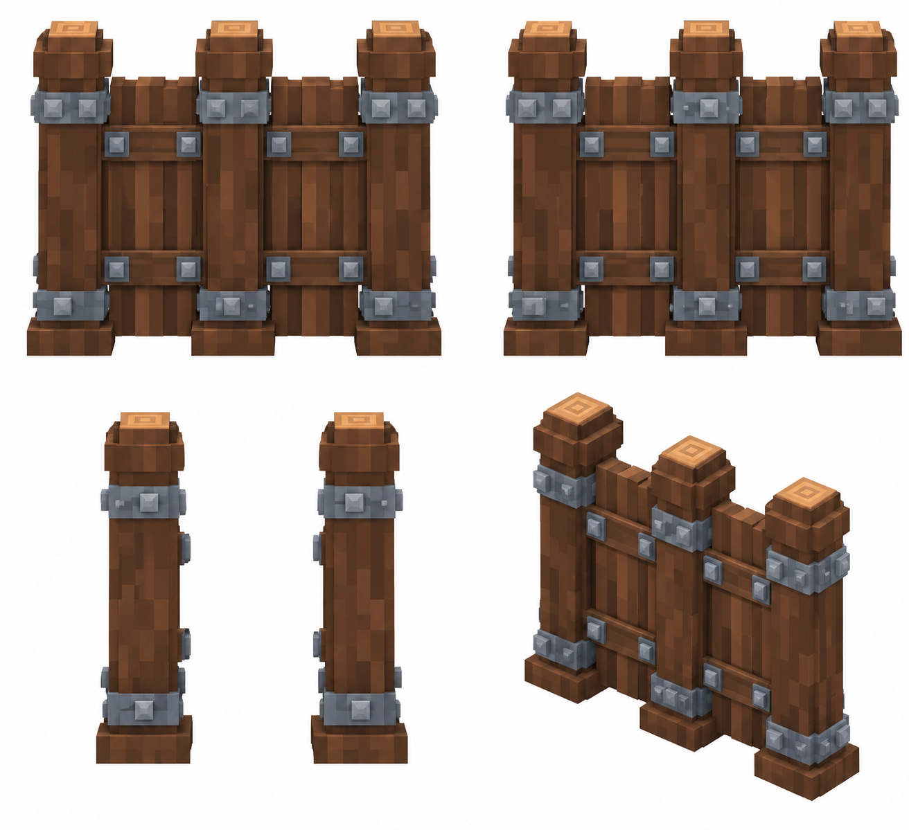

# Деревянная стена

Статус: **candidate**, художественный референс для проверки пользователем.

Пять ракурсов одной существующей постройки. Крупные воксели; без ландшафта, внешней подставки и подписей.

Страница CubeSiege: [Деревянная стена](https://chatgpt.com/space/page_cad2530bda488191b1521c152b614ba6).

Происхождение и параметры: `provenance.json`; точный промпт: `prompt.txt`; наблюдения: `inspection.json`.
