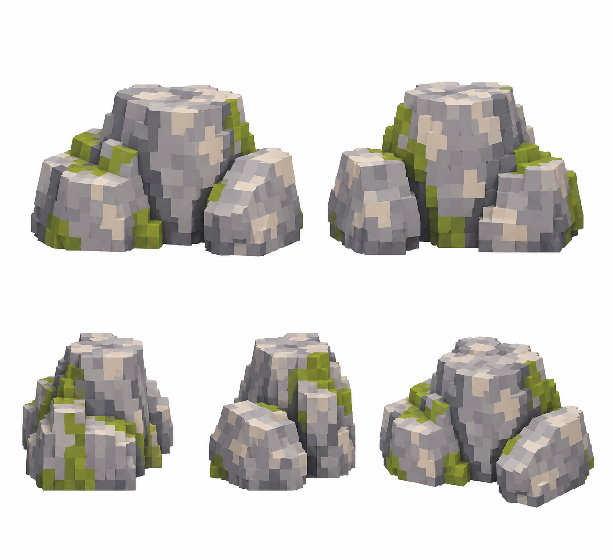

# Крупные обломки — усечённая глыба

Статус: **candidate**, художественный референс для проверки пользователем.

Один вариант соответствующей стадии разрушения: пять ракурсов без земли, ландшафта и подписи.

Страница CubeSiege: [Крупные обломки — усечённая глыба](https://chatgpt.com/space/page_8a1842277d7c819192faca9c0ffb2803).

Происхождение и параметры: `provenance.json`; точный промпт: `prompt.txt`; наблюдения: `inspection.json`.
