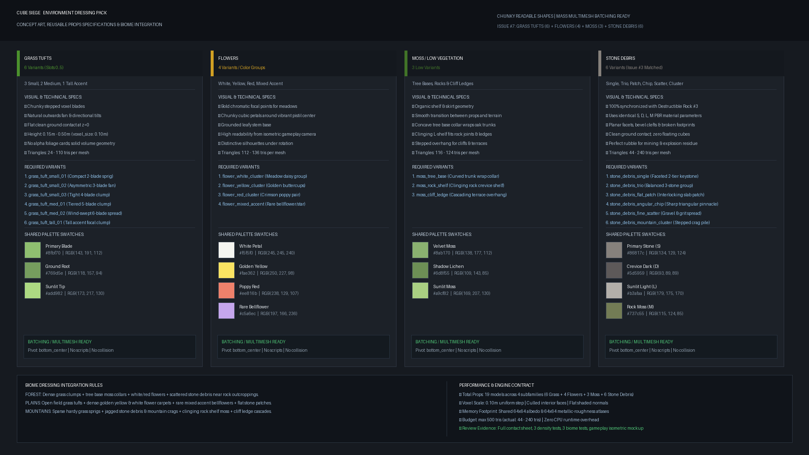

# References & Visual Contract: Environment Dressing Pack

## Approved Concept Reference

`dressing_concept_reference.png` — утверждённый визуальный контракт и технический ориентир для семейств малых объектов окружения (Issue #7). Он фиксирует состав пакета, пропорции, PBR-палитры и интеграцию с биомами Cube Siege:
- **Grass Tufts (6 вариантов)**: 3 малых, 2 средних, 1 высокий акцентный;
- **Flowers (4 варианта / архетипа)**: белые маргаритки, жёлтые лютики, красные маки, смешанные редкие колокольчики;
- **Moss / Low Vegetation (3 варианта)**: воротник у основания деревьев, полка в расщелинах камней, уступ обрывов;
- **Stone Debris (6 вариантов)**: самостоятельная более тёмная палитра концепт-референса с уникальными 3D-силуэтами.

---

## Visual & Runtime Contract

### 1. Силуэт и детализация
- **Крупные читаемые формы**: воксельная геометрия без тонких одиночных травинок из десятков полигонов.
- **Никаких альфа-карт с фототекстурами**: твердотельная стилизованная блочная геометрия с плоским шейдингом.
- **Органическая асимметрия**: разнообразие за счёт силуэта, наклона лепестков/травинок и ярусности.
- **Надёжный ground contact**: аккуратная посадка на `z=0`, без висящих в воздухе вокселей.
- **Поворотная вариативность**: не выглядят монотонно при случайном вращении вокруг оси Y.

### 2. Runtime & MultiMesh Performance
- **Маленький треугольный бюджет**: каждый проп содержит от 84 до 262 треугольников (бюджет <= 500 tris, среднее 169.9 tris).
- **Пивот строго `bottom_center`**: точка привязки в основании для корректного MultiMesh-спавна на наклонных поверхностях террейна.
- **Без коллизий и скриптов**: ассеты оптимизированы для массового batching / MultiMesh GPU instancing.
- **Shared Material Strategy**: зафиксирована единая палитра `palette.json`, единый шейдинг и общие текстурные атласы `textures/dressing_palette_atlas.png` (sRGB baseColor) и `textures/dressing_roughness_atlas.png` (linear roughness).

### 3. Согласованность с биомами и стилем
- **Stone Debris**: использует самостоятельную более тёмную палитру из утверждённого концепт-референса (`S`: #5b5652, `D`: #3e3d3b, `L`: #65615b, `M`: #5a673e) для четкой контрастной читаемости мелких камней на фоне грунта и травы.
- **Foliage & Moss**: колористически сбалансированы с кронами `tree_oak` и материалами террейна `terrain_materials` (Forest Grass, Plains Meadow, Mountain Stone).

---

## Complete Asset Inventory (19 Variants)

| Семейство | Имя пакета | Назначение / Архетип | Воксели | Треугольники |
|:---|:---|:---|:---:|:---:|
| **Grass** | `grass_tuft_small_01` | Компактный 3-лепестковый росток (низкий разлет) | 11 | 92 |
| **Grass** | `grass_tuft_small_02` | Асимметричный веер травы | 14 | 140 |
| **Grass** | `grass_tuft_small_03` | Плотная ступенчатая кочка | 25 | 152 |
| **Grass** | `grass_tuft_med_01` | Средний ярусный многолепестковый пучок | 37 | 228 |
| **Grass** | `grass_tuft_med_02` | Средний ветровой наклонный веер | 29 | 144 |
| **Grass** | `grass_tuft_tall_01` | Высокий доминантный акцентный пучок | 40 | 212 |
| **Flowers** | `flower_white_cluster` | Белые луговые ромашки (золотая сердцевина) | 31 | 204 |
| **Flowers** | `flower_yellow_cluster` | Солнечные лютики (золотые лепестки, купол) | 27 | 136 |
| **Flowers** | `flower_red_cluster` | Яркие маки (алые лепестки, чашевидный венчик) | 34 | 236 |
| **Flowers** | `flower_mixed_accent` | Редкий лавандово-синий колокольчик | 28 | 184 |
| **Moss** | `moss_tree_base` | Воротник-юбка для основания ствола дерева | 20 | 144 |
| **Moss** | `moss_rock_shelf` | Угловая полка для расщелин камней и выступов | 27 | 144 |
| **Moss** | `moss_cliff_ledge` | Свисающий каскад для карнизов обрывов | 26 | 148 |
| **Stone** | `stone_debris_single` | Одиночный граненый замковый скол скалы | 11 | 84 |
| **Stone** | `stone_debris_trio` | Сбалансированная группа из 3 небольших камней | 17 | 184 |
| **Stone** | `stone_debris_flat_patch` | Плоская группа каменных плит со мхом | 23 | 188 |
| **Stone** | `stone_debris_angular_chip`| Острый сколотый обломок-пик с гранью | 13 | 152 |
| **Stone** | `stone_debris_fine_scatter`| Мелкая щебеночная россыпь / гравий | 12 | 262 |
| **Stone** | `stone_debris_mountain_cluster`| Горный ступенчатый кряжистый кластер | 25 | 194 |
