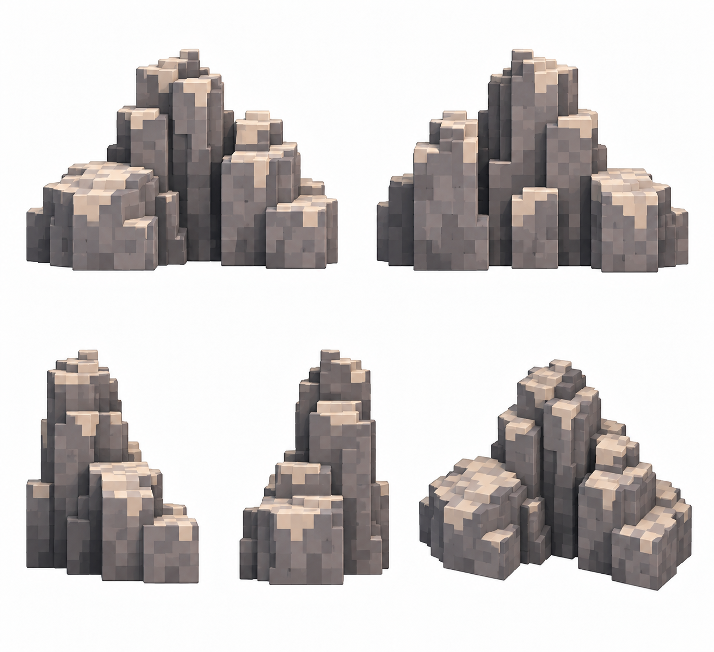

# Декор — горный обломок

Статус: **candidate**, художественный референс для проверки пользователем.

Пять ракурсов одного варианта декора. Крупные воксели, чистый фон; без земли и демонстрационной подложки.

Страница CubeSiege: [Декор — горный обломок](https://chatgpt.com/space/page_8b516544f5d4819199fe01cddfac3bb6).

Происхождение и параметры: `provenance.json`; точный промпт: `prompt.txt`; наблюдения: `inspection.json`.
