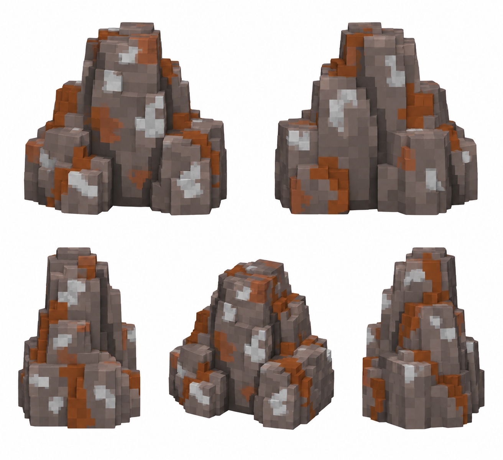

# Железная руда — вариант материала

Статус: **candidate**, художественный референс для проверки пользователем.

Материальный вариант существующего семейства скал. Геометрические варианты и стадии разрушения переиспользуются; оттенок и жилы отличают железную руду.

Страница CubeSiege: [Железная руда — вариант материала](https://chatgpt.com/space/page_f58044d4583c81919ce5b848a87d0701).

Происхождение и параметры: `provenance.json`; точный промпт: `prompt.txt`; наблюдения: `inspection.json`.
