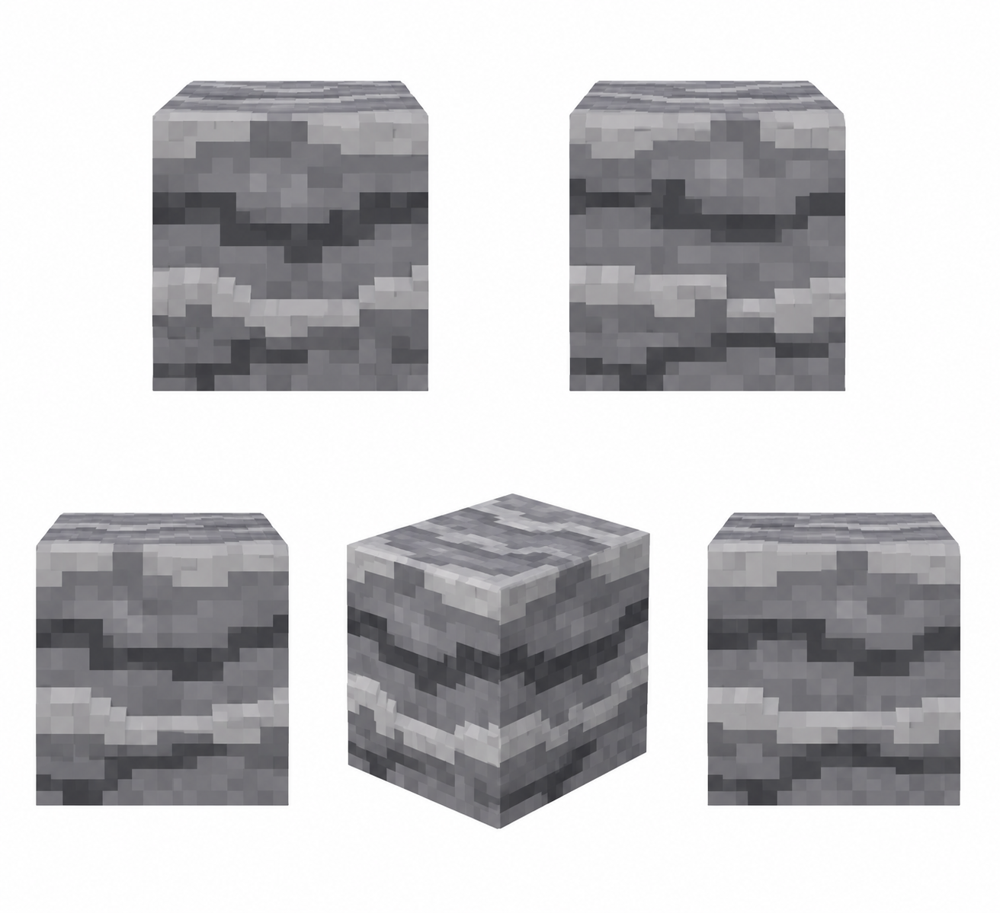

# Материал — слоистая скала

Статус: **candidate**, художественный референс для проверки пользователем.

Изолированный образец существующего материала: четыре стороны и изометрия, без ландшафта и подписей.

Страница CubeSiege: [Материал — слоистая скала](https://chatgpt.com/space/page_d72fa7295f9081918e25d36f776e8125).

Происхождение и параметры: `provenance.json`; точный промпт: `prompt.txt`; наблюдения: `inspection.json`.
