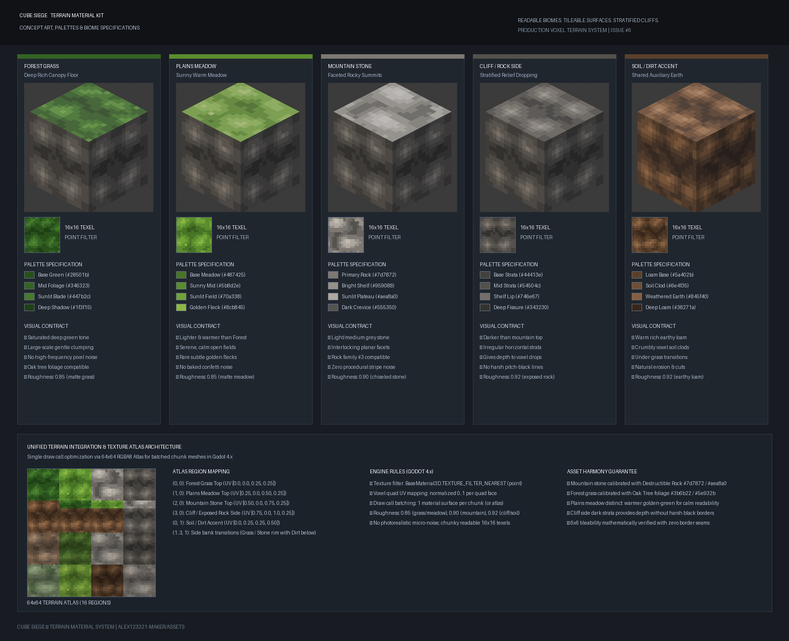

# References & Visual Contract: Terrain Material Kit

## Approved Concept Reference

`terrain_concept_reference.png` — утверждённый официальный визуальный ориентир семейства материалов террейна для Issue #6. Он фиксирует художественное направление и спецификации для процедурного воксельного мира Cube Siege:
- 4 обязательных типа поверхности террейна (Forest Grass Top, Plains Meadow Top, Mountain Stone Top, Cliff / Exposed Rock Side) плюс вспомогательный Soil / Dirt Accent;
- стилизованная воксельная графика с дискретным разрешением 16×16 текселей на грань кубического вокселя;
- nearest filtering (`TEXTURE_FILTER_NEAREST`), сохраняющий чистоту кубической геометрии без размытия рёбер;
- математически и визуально бесшовная тайлируемость (проверено на сетках 6×6);
- калибровка палитры камней с семейством разрушаемых скал `destructible_rock` (Issue #3);
- калибровка лесных оттенков с семейством дубов `tree_oak` (Issue #5);
- единый 64×64 RGBA8 Texture Atlas с UV-разметкой для батчинга чанков в один draw call в Godot 4.x.

---

## Visual Contract

В соответствии с `Issue #6`, утверждённым концептом и `docs/STYLE_GUIDE.md`:

### 1. Forest Grass Top
- **Цвет и глубина**: насыщенный глубокий лесной зелёный (`#28501b` база, `#346323` мидтон, `#447b2c` световые акценты, `#1f3f15` тени полога).
- **Вариативность**: крупномасштабная мягкая кластеризация без пиксельного шума и без эффекта шахматки.
- **Совместимость**: гармонирует с кронами дубов (`#3b6b22`, `#5e932b`) и отдельными пропсами цветов и травы.
- **Шероховатость**: `roughness = 0.85` (матовая органическая трава).

### 2. Plains Meadow Top
- **Цвет и настроение**: светлее и теплее леса (`#487425` база, `#5b8d2e` мидтон, `#70a338` солнечное поле, `#8cb845` редкие золотистые крапинки).
- **Спокойствие**: открытые луга читаются мягко и монолитно, без запечённого конфетти на каждом блоке.
- **Шероховатость**: `roughness = 0.85`.

### 3. Mountain Stone Top
- **Каменные плоскости**: светло/средне-серый стилизованный гранит (`#7d7872` первичный камень, `#959088` полка, `#aea8a0` освещённое плато, `#555350` расщелина).
- **Фасеты**: читаемые крупные плоскости и угловые сколы; отсутствие процедурных полос («полосатого прототипа»).
- **Совместимость**: 100% колористическая совместимость с `destructible_rock`.
- **Шероховатость**: `roughness = 0.90`.

### 4. Cliff / Exposed Rock Side
- **Тональность**: темнее верхней каменной поверхности (`#44413e` база, `#54504c` средний пласт, `#746e67` светлая кромка, `#343230` глубокая трещина).
- **Стратификация**: нерегулярные горизонтальные осадочные слои со ступенчатыми вертикальными сколами.
- **Глубина**: подчёркивает ступенчатый перепад высот рельефа без угольно-чёрных резких полос.
- **Шероховатость**: `roughness = 0.92`.

### 5. Soil / Dirt Accent
- **Тёплый суглинок**: богатая тёплая земля (`#5a402b` база, `#6e4f35` комья, `#845f40` сухая земля, `#38271a` подпочва).
- **Назначение**: срезы берегов, тропы, осыпающиеся кромки под дёрном.
- **Шероховатость**: `roughness = 0.92`.
