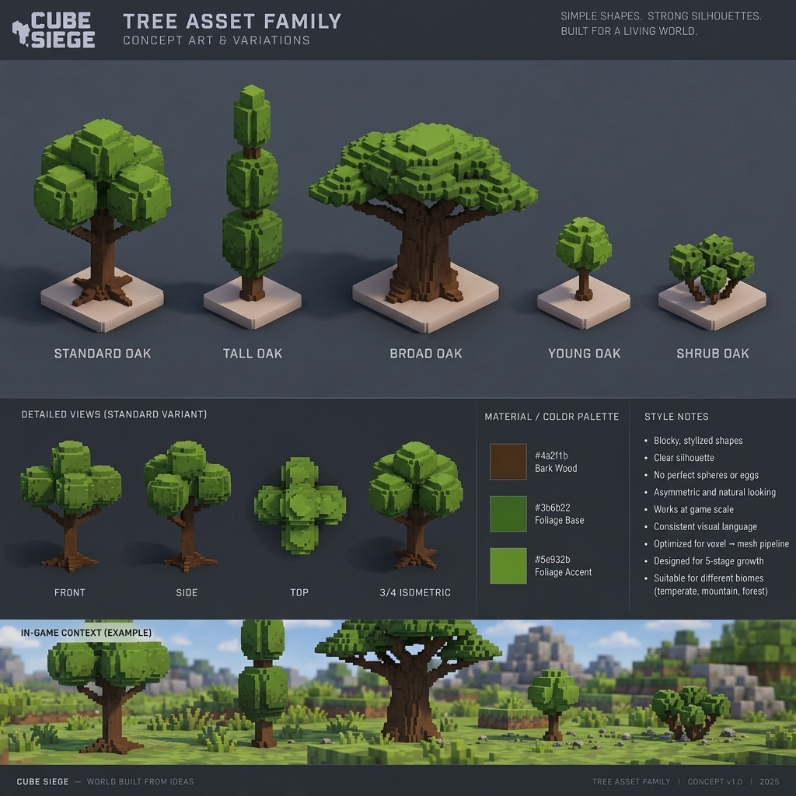

# References & Visual Contract: Oak Tree Family

## Approved Concept Reference

`tree_concept_reference.png` — утверждённый визуальный ориентир семейства для Issue #5. Он фиксирует ключевое визуальное направление игры Cube Siege:
- 5 канонических вариантов дубов, сопоставленных со слотами `ResourceTree.tree_variation` 0..4;
- стилизованная воксельная/кубическая геометрия без микрошума;
- выраженная асимметрия ветвей и крон;
- читаемые крупные массы крон, поддерживаемые видимым скелетом ветвей;
- естественное расширение комля ствола и корневые шпоры для стабильного контакта с землей;
- трёхматериальная PBR-палитра (`wood_bark`, `foliage_base`, `foliage_accent`).

---

## Visual Contract

В соответствии с `Issue #5`, утверждённым концептом и `docs/STYLE_GUIDE.md` (раздел «Деревья»):

### 1. Силуэт и форма
- **Никаких сфер или кубов**: ни одна крона не строится как идеальный шар, монолитный куб или процедурный цилиндр.
- **Читаемость ствола и скелета**: ствол и крупные ветви формируют силуэт до листвы и отчётливо видны под кроной с изометрической камеры.
- **Органическая асимметрия**: крона собирается из 2–4 независимых объемных масс, расположенных асимметрично, но без случайного воксельного шума.
- **Стабильный ground contact**: плоское основание на `z=0`, комлевой раструб ствола с расходящимися корнями.
- **Компактная fade-область**: отсутствие длинных одиночных вокселей, мешающих runtime camera-occlusion fade.

### 2. Материалы и цвета (PBR Palette)
1. `wood_bark` (`W`): тёплая тёмная кора дуба (`#4a2f1b`, roughness 0.92, metallic 0.0);
2. `foliage_base` (`D`): насыщенная глубокая лесная зелень (`#3b6b22`, roughness 0.88, metallic 0.0), контрастирующая с травой террейна;
3. `foliage_accent` (`L`): освещённые солнцем золотисто-зелёные верхушки (`#5e932b`, roughness 0.82, metallic 0.0).

### 3. Сетка и масштабирование
- **Размер вокселя**: `voxel_size = 0.15` м (15 см / воксель) — единый шаг с семейством скал `destructible_rock`.
- **Пивот / Origin**: `bottom_center` ствола (ровно по центру основания на уровне земли `z=0`).

### 4. Сопоставление со слотами интеграции (`ResourceTree.tree_variation`)
| Слот | Вариант | Роль и архетип силуэта | Высота | Ширина |
|:---:|:---|:---|:---:|:---:|
| **0** | `var_0_standard_oak` | Базовый сбалансированный взрослый дуб (4 массы кроны, видимые ветви) | ~4.20 м | ~2.70 м |
| **1** | `var_1_tall_oak` | Высокий колонновидный/пирамидальный дуб (асимметричные ярусы, изогнутый ствол) | ~5.10 м | ~2.25 м |
| **2** | `var_2_broad_oak` | Древний раскидистый дуб-зонт (мощный комлевой ствол, 4 массивных сука) | ~3.60 м | ~3.60 м |
| **3** | `var_3_young_oak` | Ювенильный саженец (~0.6x от взрослого дерева, тонкий ствол, 2 массы) | ~2.40 м | ~1.65 м |
| **4** | `var_4_shrub_oak` | Горный низкорослый кустарниковый дуб (кустовидный, по пояс 2м персонажу) | ~1.35 м | ~1.80 м |
