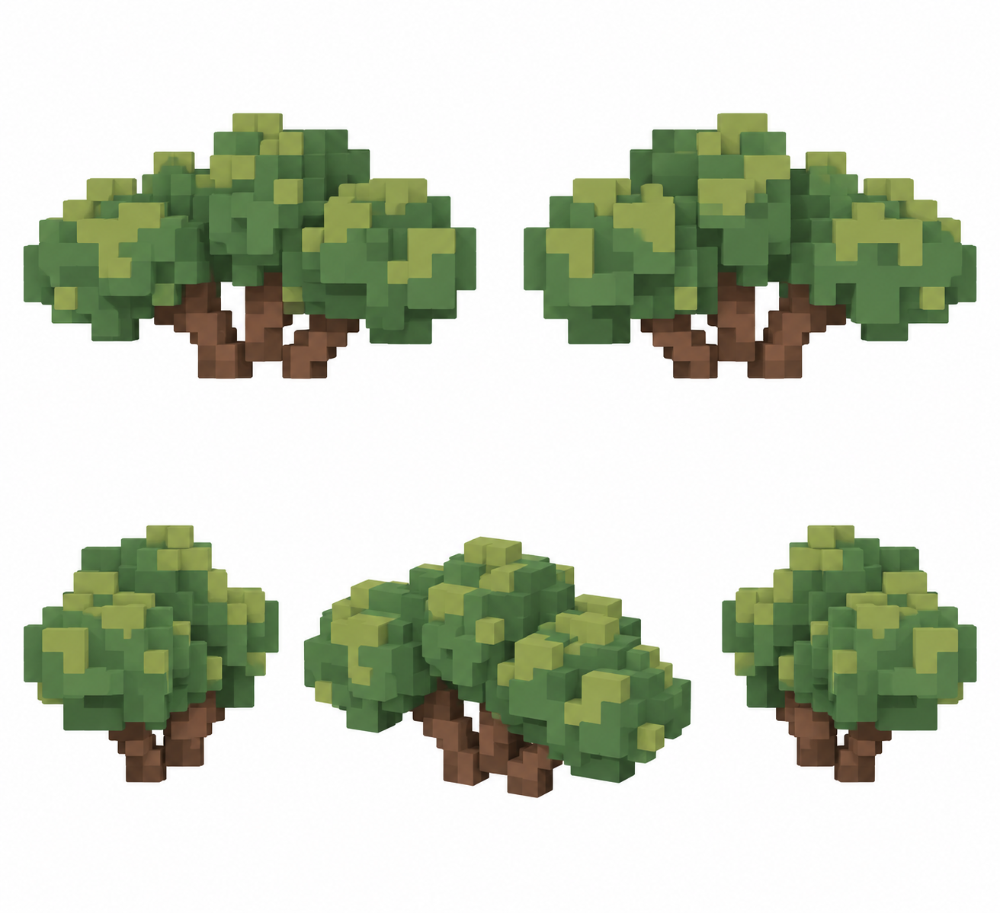

# Кустовой дуб

Статус: **candidate**, художественный референс для проверки пользователем.

Отдельный вариант дуба: пять ракурсов на белом фоне; без земли, площадки и ландшафта.

Страница CubeSiege: [Кустовой дуб](https://chatgpt.com/space/page_4b10edf1c2f48191901cba58a1571ca4).

Происхождение и параметры: `provenance.json`; точный промпт: `prompt.txt`; наблюдения: `inspection.json`.
