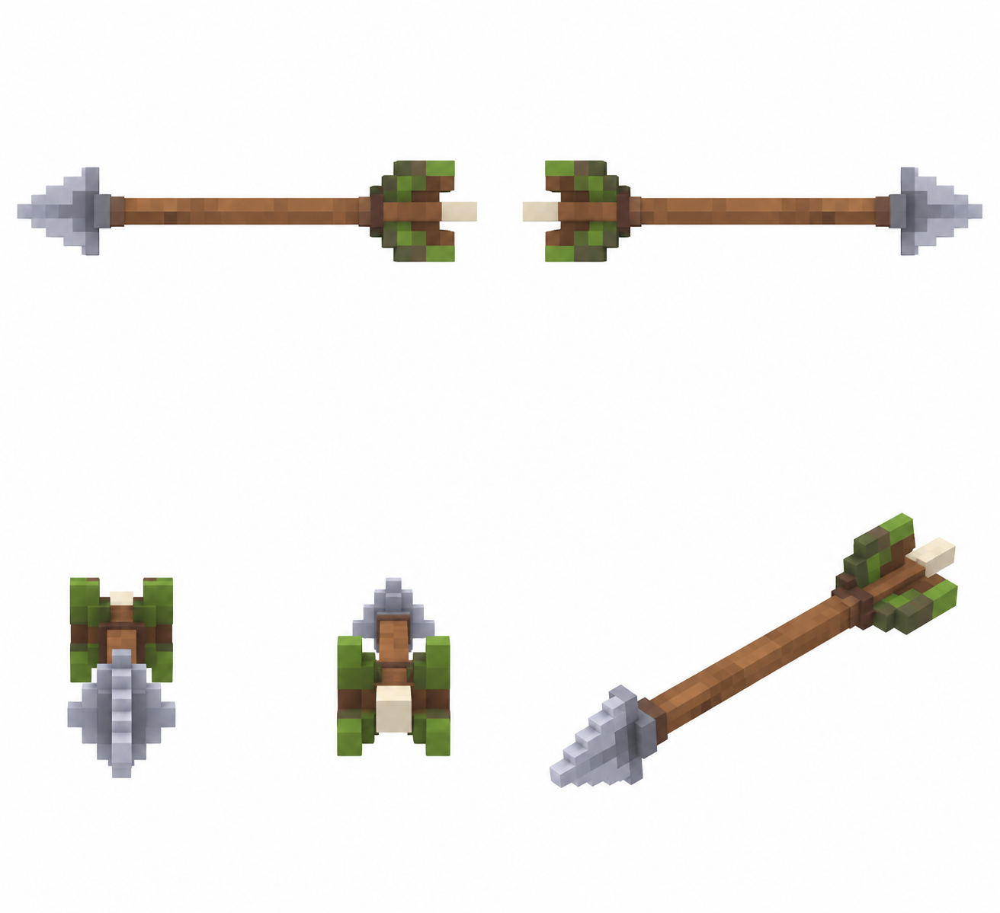

# Стрела — полёт — 5 видов

Статус: **candidate**, художественный референс для проверки пользователем.

Пять ракурсов одного объекта/момента в крупной воксельной стилистике. Художественный референс; правила срабатывания берутся из текста способности, анимация и читаемость в движке не проверены.

Страница CubeSiege: [Стрела — полёт — 5 видов](https://chatgpt.com/space/page_936e5105da14819189cc473fb8ee8bc9).

Происхождение и параметры: `provenance.json`; точный промпт: `prompt.txt`; наблюдения: `inspection.json`.
