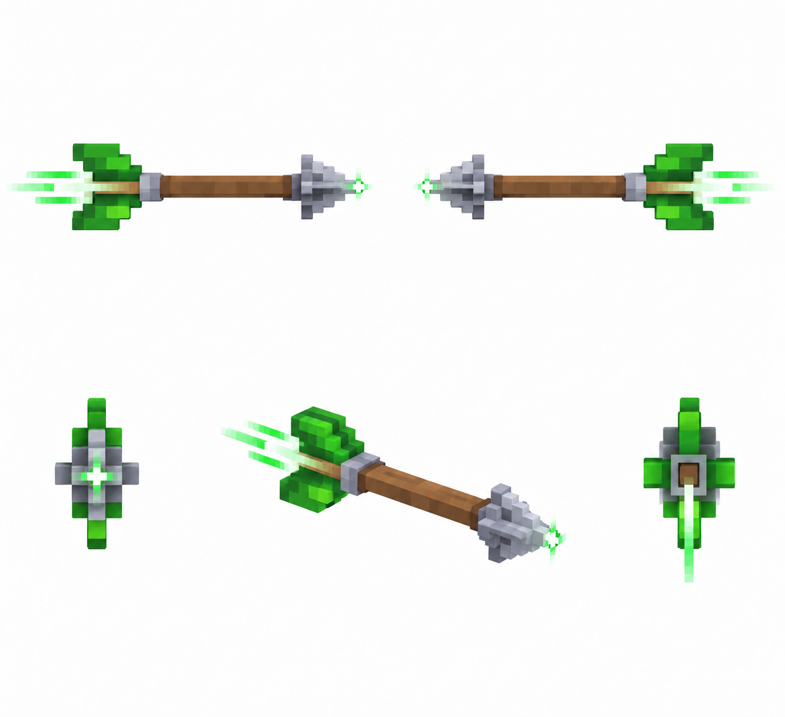

# Сквозная стрела — полёт — 5 видов

Статус: **candidate**, художественный референс для проверки пользователем.

Пять ракурсов одного объекта/момента в крупной воксельной стилистике. Художественный референс; правила срабатывания берутся из текста способности, анимация и читаемость в движке не проверены.

Страница CubeSiege: [Сквозная стрела — полёт — 5 видов](https://chatgpt.com/space/page_fcc7bbb8f31481919ad964b5cb6d417c).

Происхождение и параметры: `provenance.json`; точный промпт: `prompt.txt`; наблюдения: `inspection.json`.
