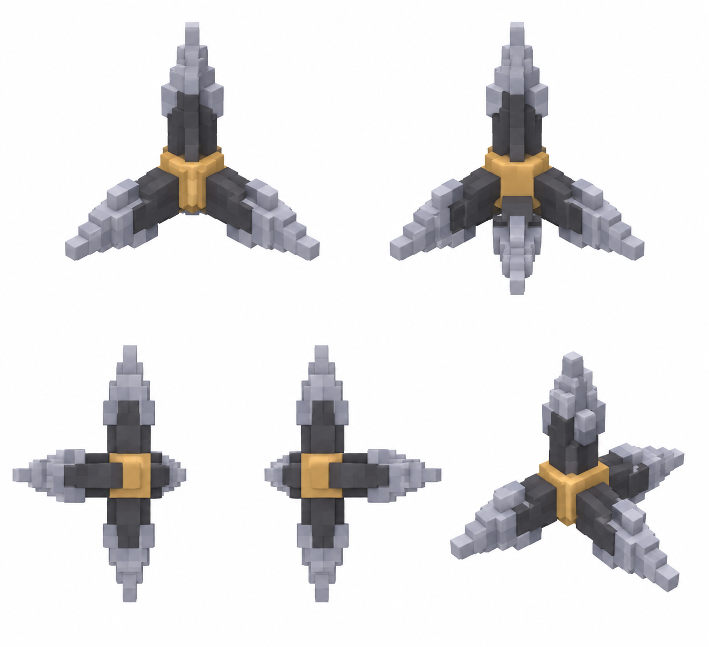

# Тактический отскок — замедляющий шип — 5 видов

Статус: **candidate**, художественный референс для проверки пользователем.

Пять ракурсов одного объекта/момента в крупной воксельной стилистике. Художественный референс; правила срабатывания берутся из текста способности, анимация и читаемость в движке не проверены. Шип относится к концепту GDD; его отсутствие в прототипе отмечено на странице.

Страница CubeSiege: [Тактический отскок — замедляющий шип — 5 видов](https://chatgpt.com/space/page_e794bf8e31d88191a834a4fe6443849c).

Происхождение и параметры: `provenance.json`; точный промпт: `prompt.txt`; наблюдения: `inspection.json`.
