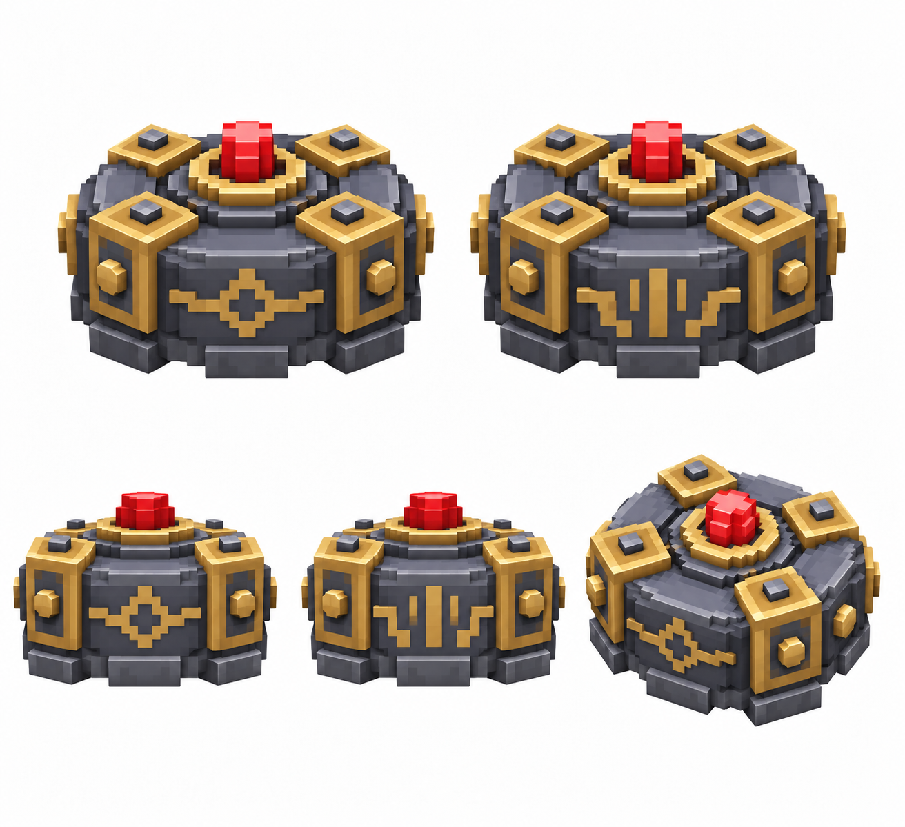

# Управляемая мина — модель

Статус: **candidate**, художественный референс для проверки пользователем.

Пять ракурсов физического объекта способности. Дизайн согласован с её пиксельной иконкой; крупные фэнтезийные воксели, чистый белый фон.

Страница CubeSiege: [Управляемая мина — модель](https://chatgpt.com/space/page_a05fba85c50c8191a6b4586961e217be).

Происхождение и параметры: `provenance.json`; точный промпт: `prompt.txt`; наблюдения: `inspection.json`.
