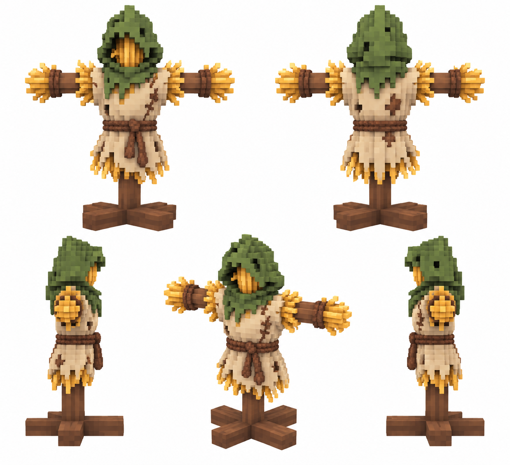

# Приманка — модель

Статус: **candidate**, художественный референс для проверки пользователем.

Пять ракурсов физического объекта способности. Дизайн согласован с её пиксельной иконкой; крупные фэнтезийные воксели, чистый белый фон.

Страница CubeSiege: [Приманка — модель](https://chatgpt.com/space/page_53627e1d31d48191b481982aebd811d1).

Происхождение и параметры: `provenance.json`; точный промпт: `prompt.txt`; наблюдения: `inspection.json`.
