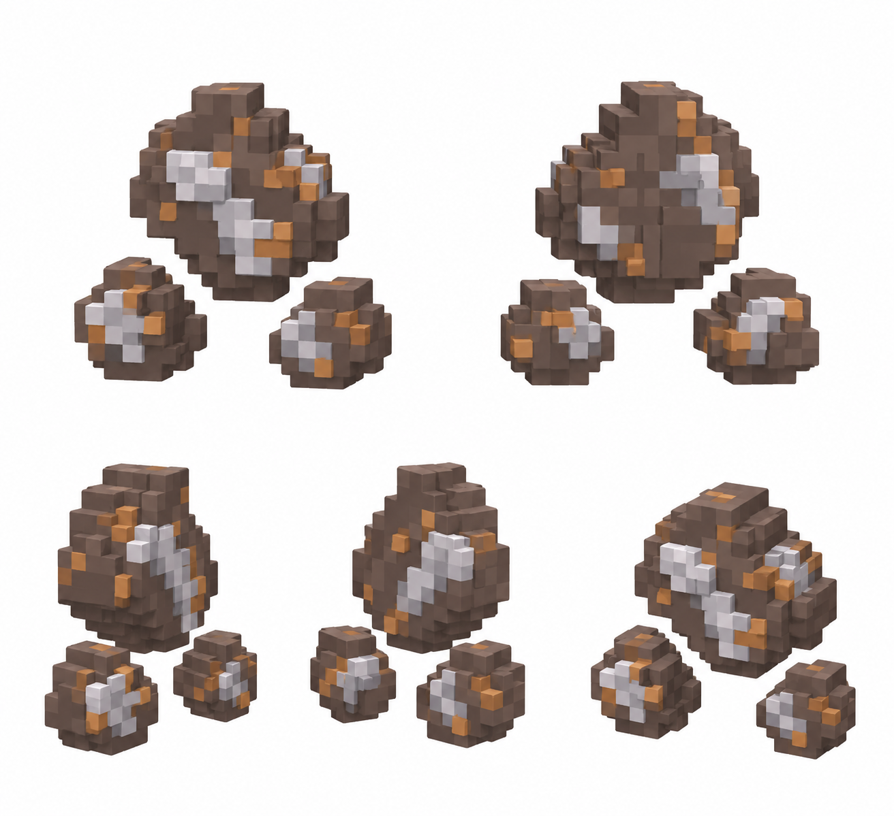

# Железо — добытый ресурс

Статус: **candidate**, художественный референс для проверки пользователем.

Пять ракурсов набора из трёх отделённых частей добытого ресурса. Количество частей — визуальная композиция, не новая категория или баланс.

Страница CubeSiege: [Железо — добытый ресурс](https://chatgpt.com/space/page_f58044d4583c81919ce5b848a87d0701).

Происхождение и параметры: `provenance.json`; точный промпт: `prompt.txt`; наблюдения: `inspection.json`.
