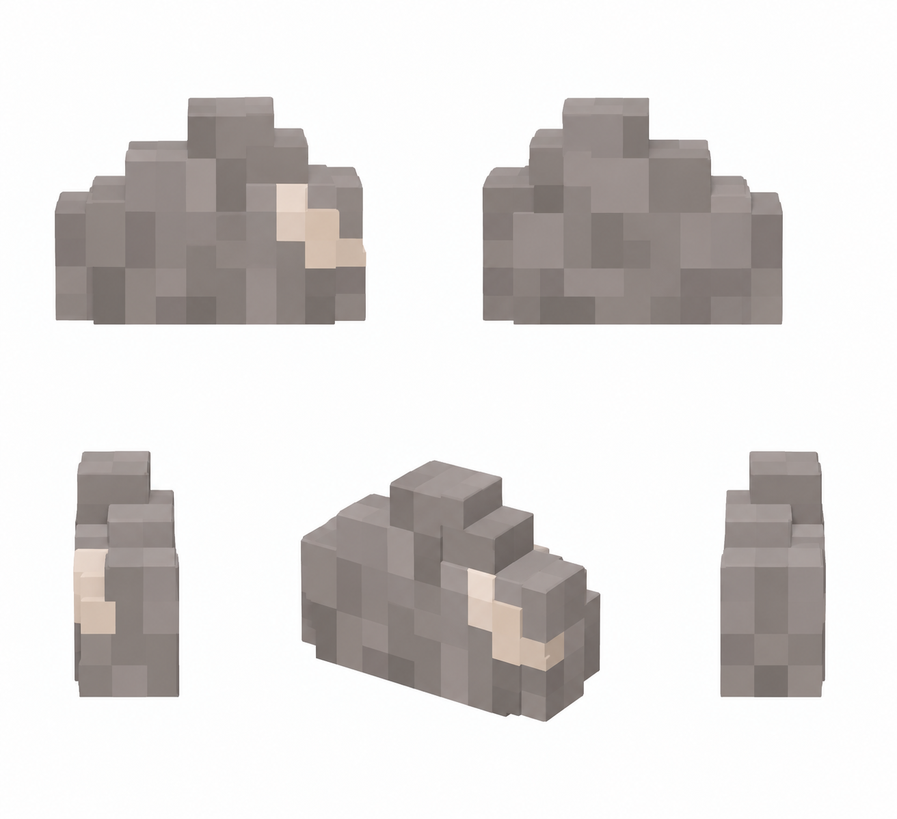

# Камень — добытый ресурс

Статус: **candidate**, художественный референс для проверки пользователем.

Пять ракурсов одной части добытого ресурса. В игре используются 1–3 экземпляра; количество и масштаб задаёт существующая система подбора.

Страница CubeSiege: [Камень — добытый ресурс](https://chatgpt.com/space/page_f58044d4583c81919ce5b848a87d0701).

Происхождение и параметры: `provenance.json`; точный промпт: `prompt.txt`; наблюдения: `inspection.json`.
