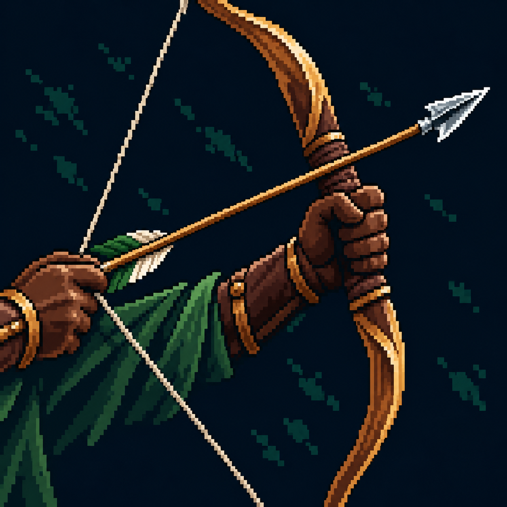

# Выстрел из лука

Статус: **candidate**, художественный референс для проверки пользователем.

Натянутый деревянный лук и одна стрела с правильным положением тетивы.

Страница CubeSiege: [Выстрел из лука](https://chatgpt.com/space/page_936e5105da14819189cc473fb8ee8bc9).

Происхождение и параметры: `provenance.json`; точный промпт: `prompt.txt`; наблюдения: `inspection.json`.
