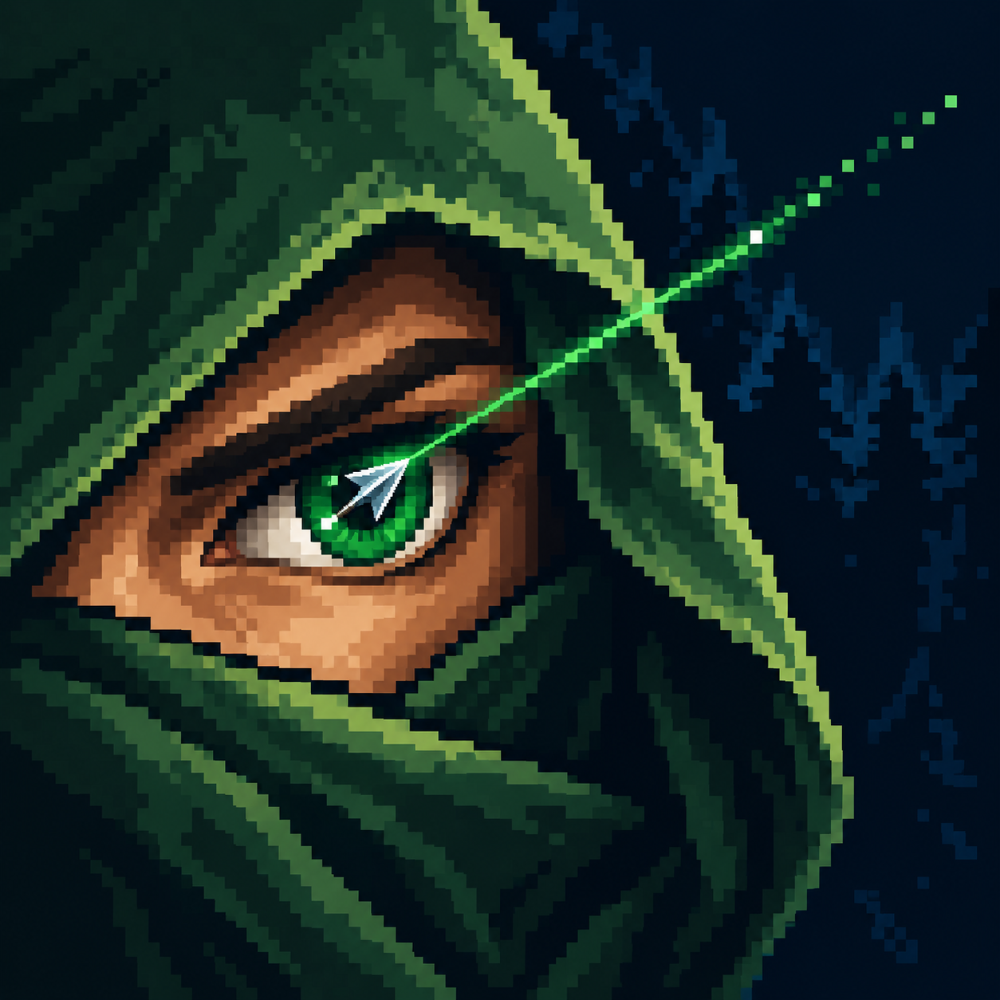

# Око снайпера

Статус: **candidate**, художественный референс для проверки пользователем.

Глаз под зелёным капюшоном обозначает точность и дальний обзор без уточнения режима активации.

Страница CubeSiege: [Око снайпера](https://chatgpt.com/space/page_9819e8f728288191bf2bf4b20a328448).

Происхождение и параметры: `provenance.json`; точный промпт: `prompt.txt`; наблюдения: `inspection.json`.
