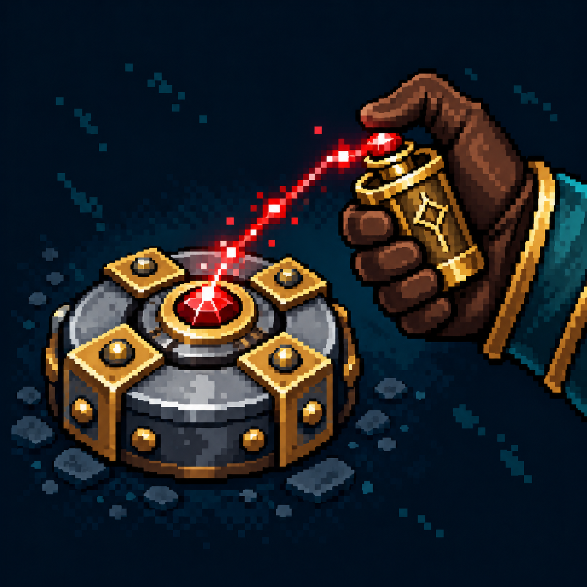

# Управляемая мина

Статус: **candidate**, художественный референс для проверки пользователем.

Мина и ручной активатор подчёркивают выбор момента подрыва.

Страница CubeSiege: [Управляемая мина](https://chatgpt.com/space/page_a05fba85c50c8191a6b4586961e217be).

Происхождение и параметры: `provenance.json`; точный промпт: `prompt.txt`; наблюдения: `inspection.json`.
