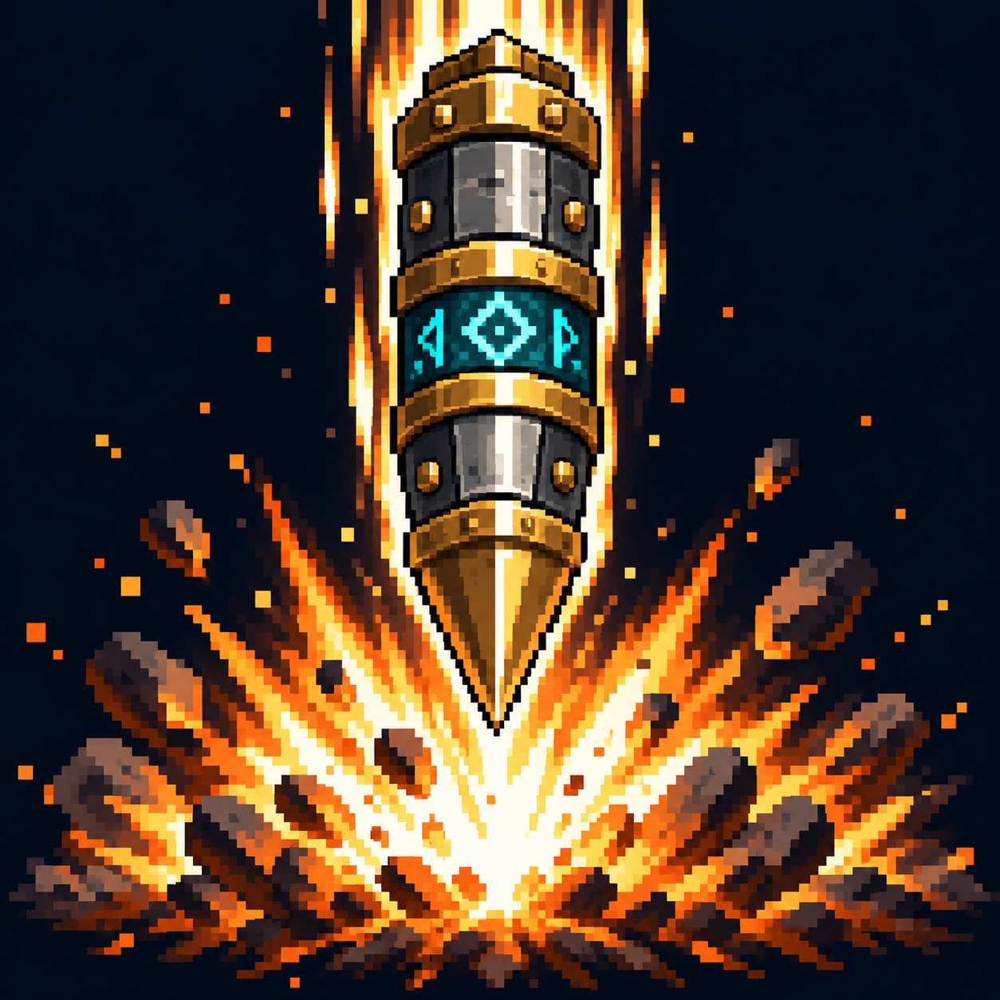

# Орбитальный удар

Статус: **candidate**, художественный референс для проверки пользователем.

Удар сверху: тяжёлый снаряд и огненный акцент в области попадания.

Страница CubeSiege: [Орбитальный удар](https://chatgpt.com/space/page_3357b27a71e88191a1736340a295c874).

Происхождение и параметры: `provenance.json`; точный промпт: `prompt.txt`; наблюдения: `inspection.json`.
