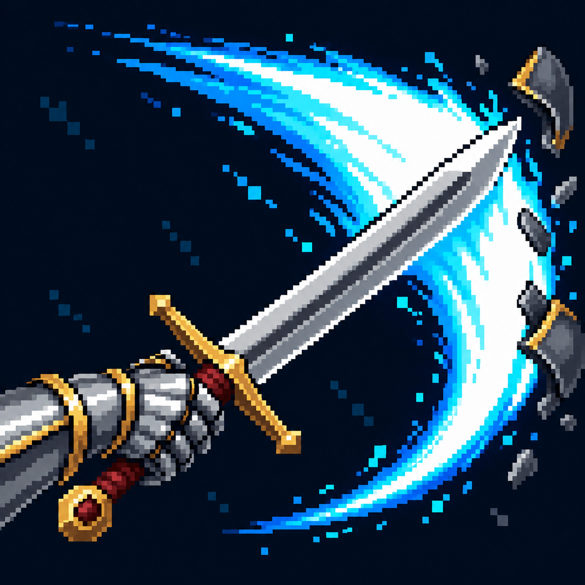

# Рассечение

Статус: **candidate**, художественный референс для проверки пользователем.

Широкий фронтальный взмах меча; частичная дуга следует режущей части клинка.

Страница CubeSiege: [Рассечение](https://chatgpt.com/space/page_5f044fe4ab8c81918129e1d7126c2943).

Происхождение и параметры: `provenance.json`; точный промпт: `prompt.txt`; наблюдения: `inspection.json`.
