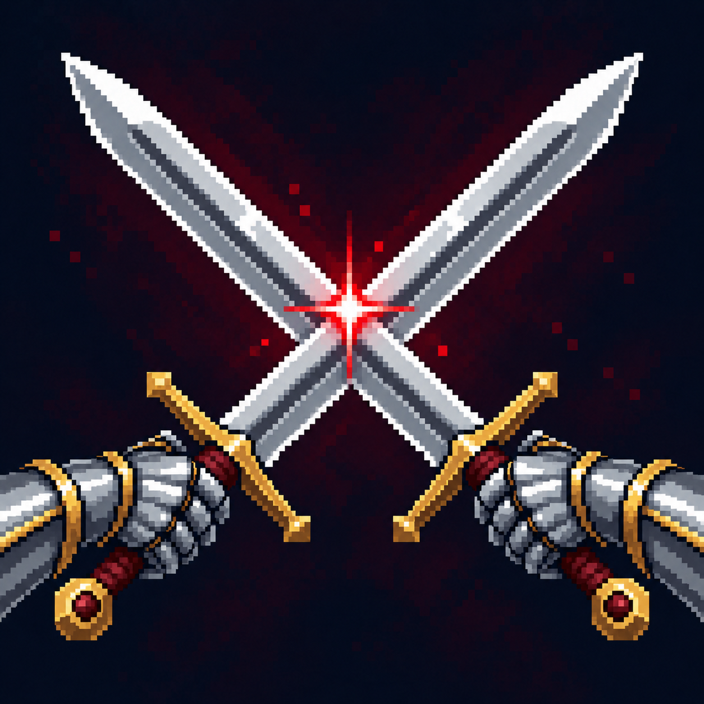

# Вызов на Дуэль

Статус: **candidate**, художественный референс для проверки пользователем.

Скрещённые клинки обозначают вызов одному противнику.

Страница CubeSiege: [Вызов на Дуэль](https://chatgpt.com/space/page_1ea982eae7388191b07f3b4a8d1c13a0).

Происхождение и параметры: `provenance.json`; точный промпт: `prompt.txt`; наблюдения: `inspection.json`.
