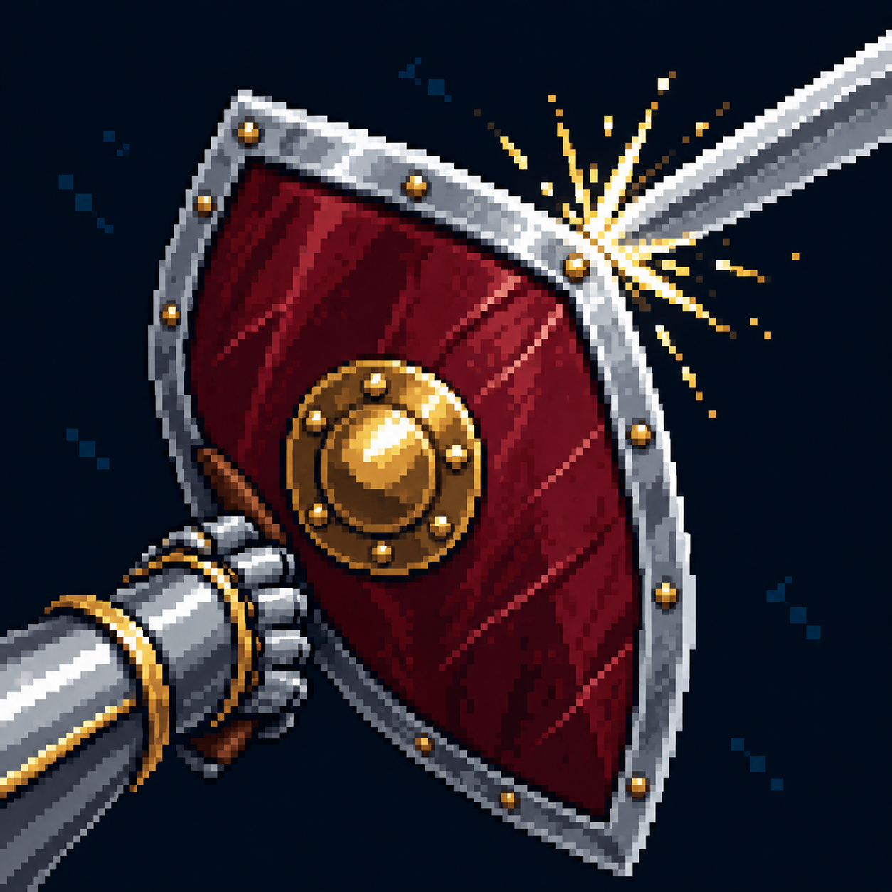

# Парирование

Статус: **candidate**, художественный референс для проверки пользователем.

Один удар перехвачен щитом; искры расположены в точке контакта.

Страница CubeSiege: [Парирование](https://chatgpt.com/space/page_c5f59f413d388191aada1c707a572956).

Происхождение и параметры: `provenance.json`; точный промпт: `prompt.txt`; наблюдения: `inspection.json`.
