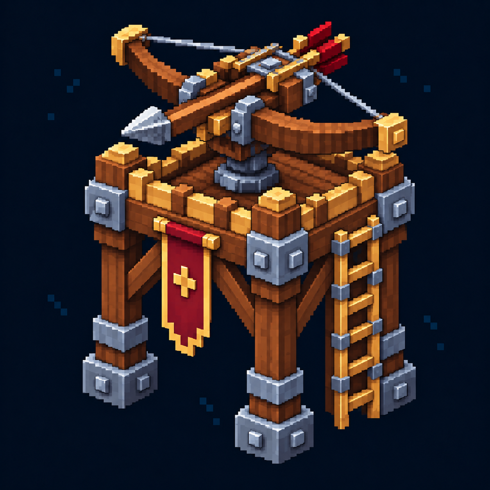

# Стрелковая башня — иконка

Статус: **candidate**, художественный референс для проверки пользователем.

Пиксельная иконка меню строительства, согласованная с пятиракурсным референсом этой постройки.

Страница CubeSiege: [Стрелковая башня — иконка](https://chatgpt.com/space/page_bc05286551048191b2154c765f42356b).

Происхождение и параметры: `provenance.json`; точный промпт: `prompt.txt`; наблюдения: `inspection.json`.
