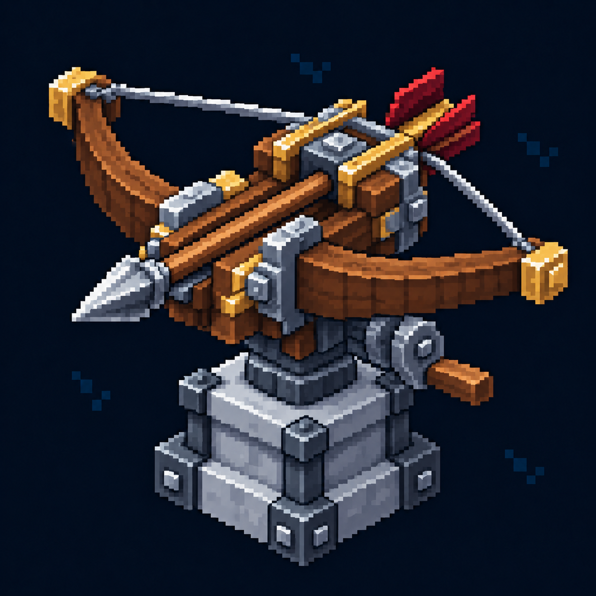

# Баллиста — иконка

Статус: **candidate**, художественный референс для проверки пользователем.

Пиксельная иконка меню строительства, согласованная с пятиракурсным референсом этой постройки.

Страница CubeSiege: [Баллиста — иконка](https://chatgpt.com/space/page_a8c020fb9ff48191b09c5eff1e4f2dcc).

Происхождение и параметры: `provenance.json`; точный промпт: `prompt.txt`; наблюдения: `inspection.json`.
