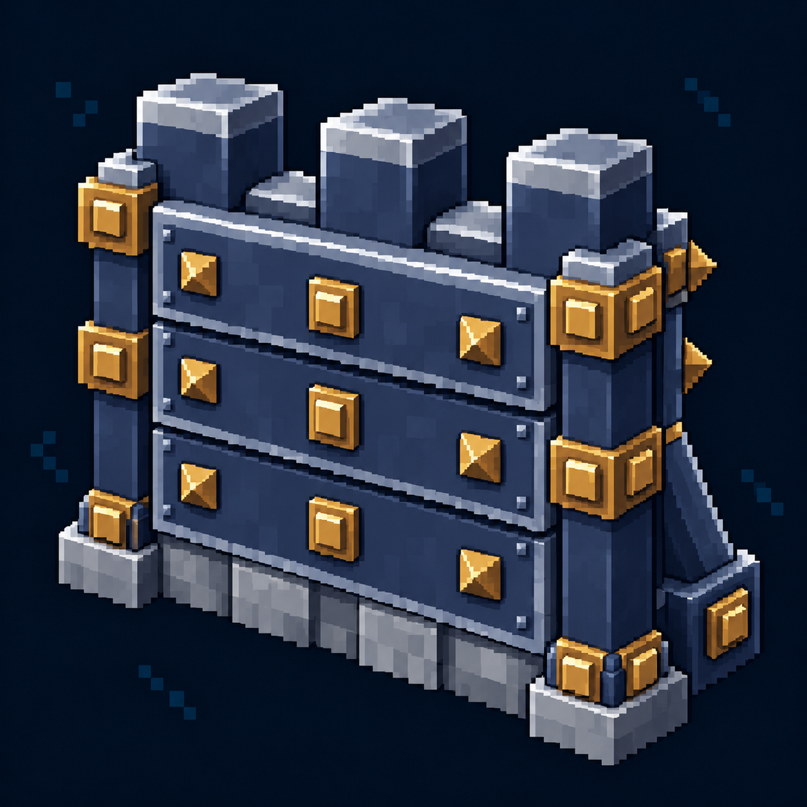

# Железная стена — иконка

Статус: **candidate**, художественный референс для проверки пользователем.

Пиксельная иконка меню строительства, согласованная с пятиракурсным референсом этой постройки.

Страница CubeSiege: [Железная стена — иконка](https://chatgpt.com/space/page_698ffce1725881918eabf22f3137d678).

Происхождение и параметры: `provenance.json`; точный промпт: `prompt.txt`; наблюдения: `inspection.json`.
