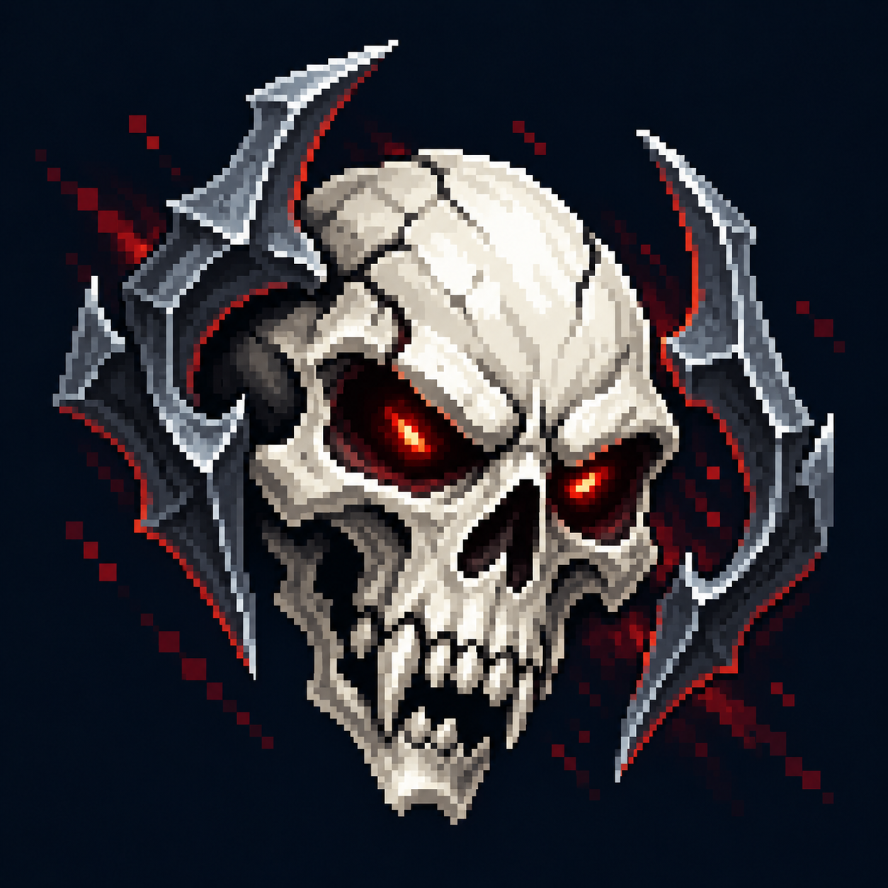

# Волна врагов

Статус: **candidate**, художественный референс для проверки пользователем.

Единая пиксельная графика HUD: тёмно-синяя основа, сталь и латунь, чёткий силуэт и функциональный цвет.

Страница CubeSiege: [Волна врагов](https://chatgpt.com/space/page_37d4ce8fd7d48191a94aa3a77d87d607).

Происхождение и параметры: `provenance.json`; точный промпт: `prompt.txt`; наблюдения: `inspection.json`.
