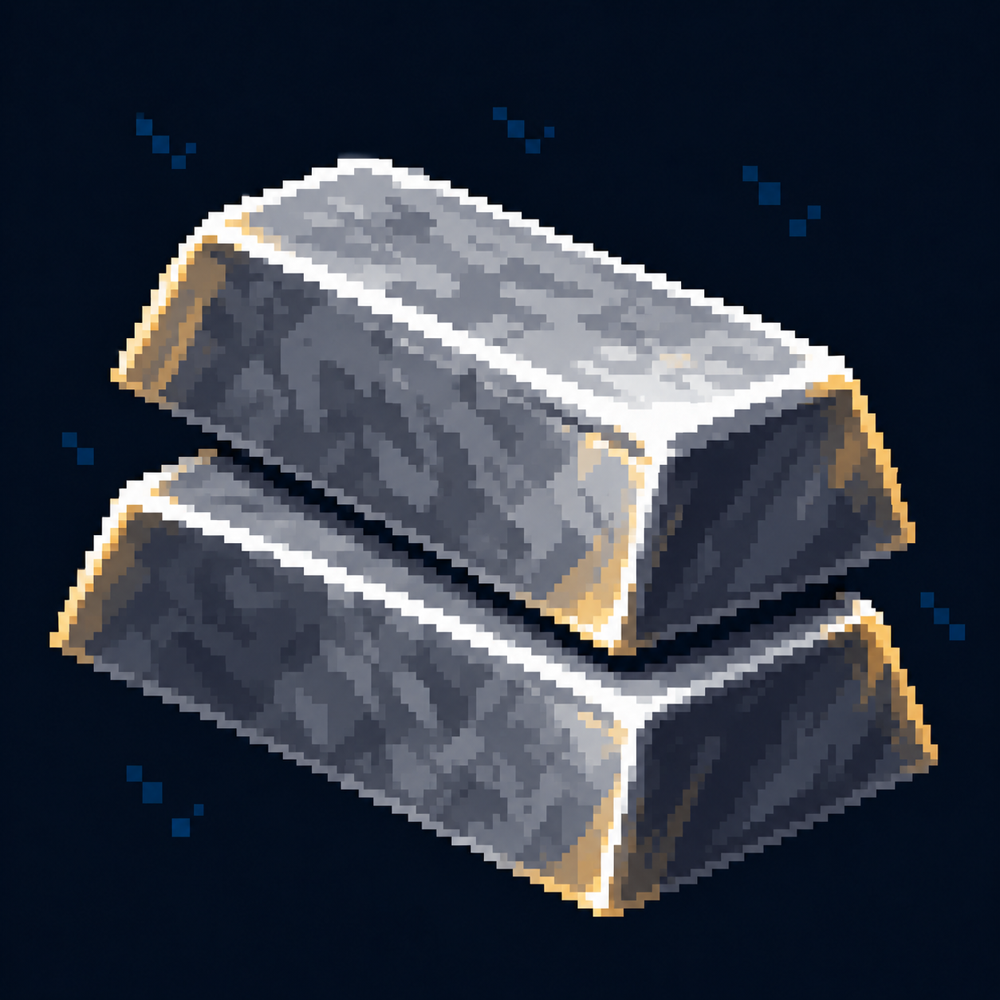

# Железо — HUD

Статус: **candidate**, художественный референс для проверки пользователем.

Единая пиксельная графика HUD: тёмно-синяя основа, сталь и латунь, чёткий силуэт и функциональный цвет.

Страница CubeSiege: [Железо — HUD](https://chatgpt.com/space/page_f58044d4583c81919ce5b848a87d0701).

Происхождение и параметры: `provenance.json`; точный промпт: `prompt.txt`; наблюдения: `inspection.json`.
