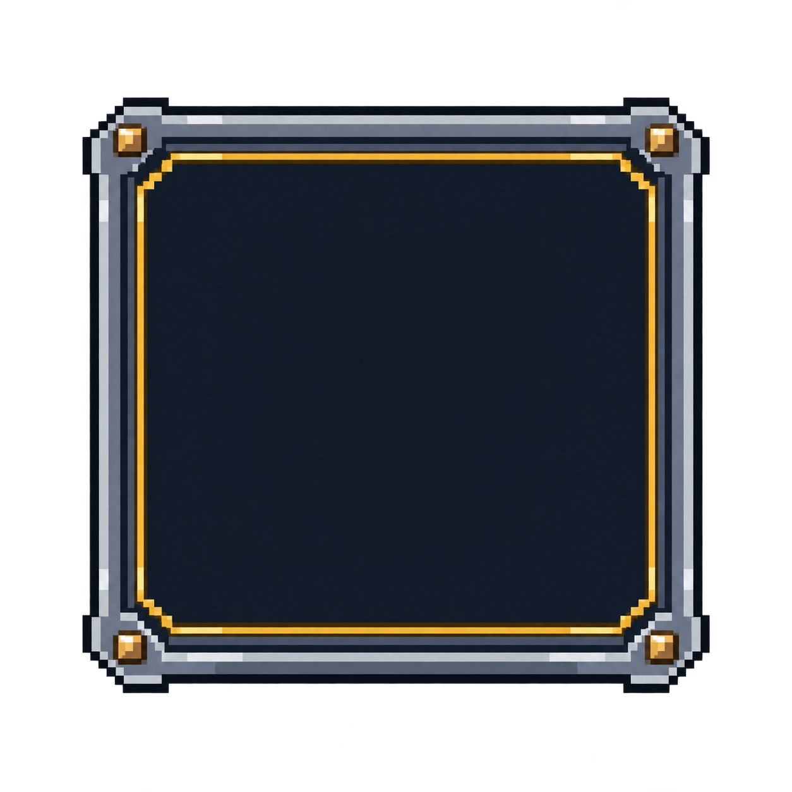

# Ячейка способности — выбрана

Статус: **candidate**, художественный референс для проверки пользователем.

Пиксельный UI-компонент с прозрачным внешним фоном. Это визуальный референс; runtime-экспорт и проверка в движке не выполнены.

Страница CubeSiege: [Ячейка способности — выбрана](https://chatgpt.com/space/page_37d4ce8fd7d48191a94aa3a77d87d607).

Происхождение и параметры: `provenance.json`; точный промпт: `prompt.txt`; наблюдения: `inspection.json`.
