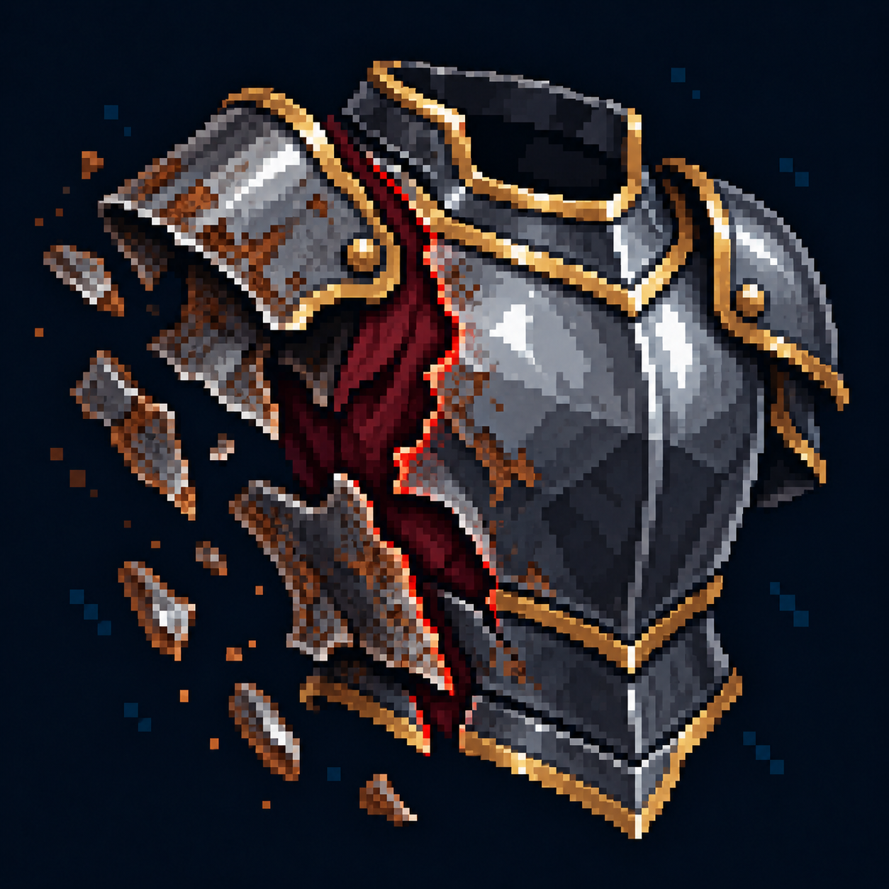

# Снижение брони?

Статус: **candidate**, художественный референс для проверки пользователем.

Расколотая наружная пластина показывает ослабление защиты. Визуальная трактовка существующего эффекта под вопросом; не утверждает его механику.

Страница CubeSiege: [Снижение брони?](https://chatgpt.com/space/page_6c92896a10c88191b72391b46d41aea8).

Происхождение и параметры: `provenance.json`; точный промпт: `prompt.txt`; наблюдения: `inspection.json`.
