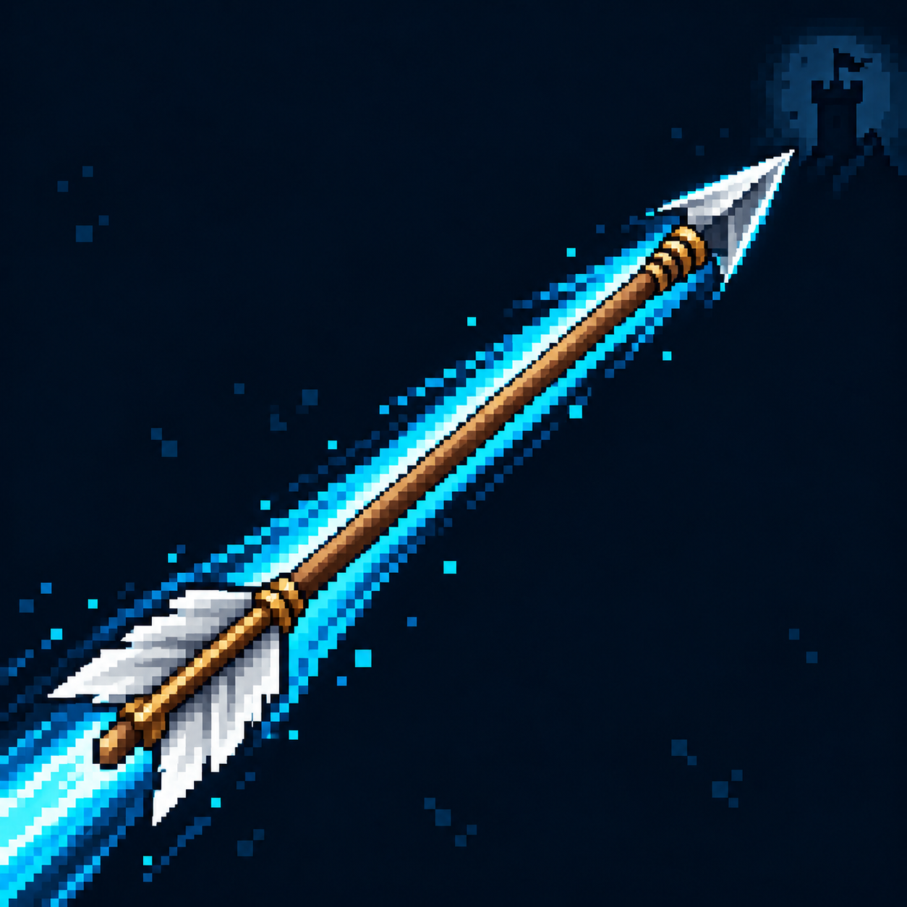

# Увеличение дальности атак?

Статус: **candidate**, художественный референс для проверки пользователем.

Одна стрела с протяжённым следом подчёркивает дальность полёта. Визуальная трактовка существующего эффекта под вопросом; не утверждает его механику.

Страница CubeSiege: [Увеличение дальности атак?](https://chatgpt.com/space/page_82359c772ac48191aed3136bd656d7ed).

Происхождение и параметры: `provenance.json`; точный промпт: `prompt.txt`; наблюдения: `inspection.json`.
