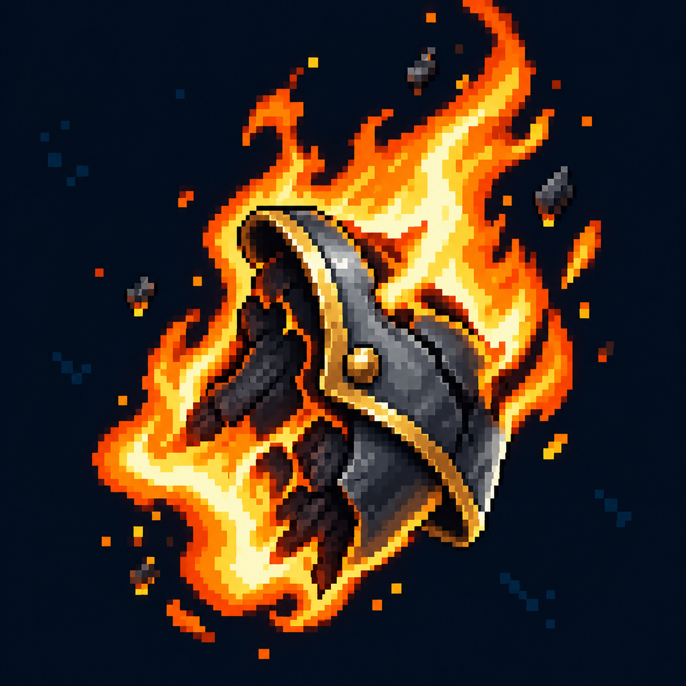

# Горение

Статус: **candidate**, художественный референс для проверки пользователем.

Яркое пламя вокруг обугленного объекта и редкие частицы пепла.

Страница CubeSiege: [Горение](https://chatgpt.com/space/page_4150ce71bf708191b0bd951aa74c2566).

Происхождение и параметры: `provenance.json`; точный промпт: `prompt.txt`; наблюдения: `inspection.json`.
