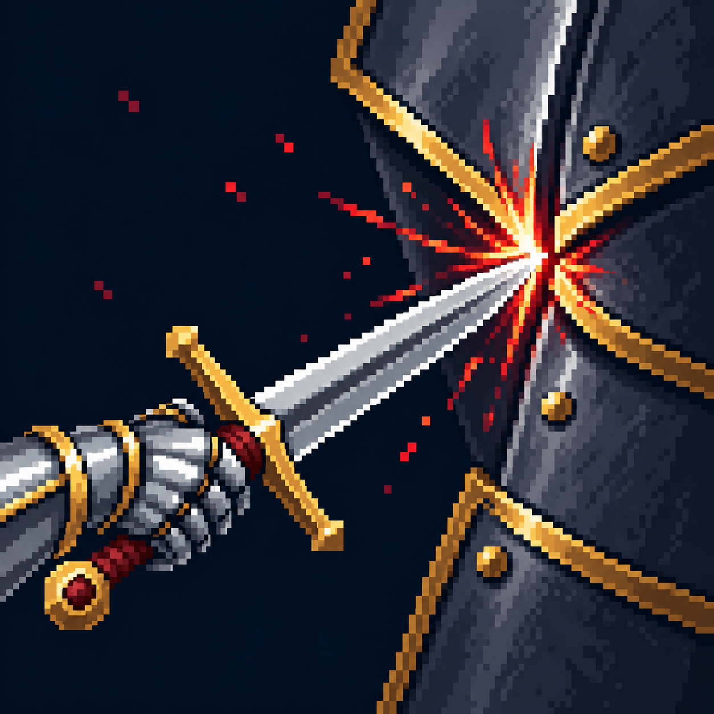

# Повышение шанса критического удара?

Статус: **candidate**, художественный референс для проверки пользователем.

Точное попадание в стык брони; без численного обозначения шанса. Визуальная трактовка существующего эффекта под вопросом; не утверждает его механику.

Страница CubeSiege: [Повышение шанса критического удара?](https://chatgpt.com/space/page_1ffb384999b881919d0659aec10e795f).

Происхождение и параметры: `provenance.json`; точный промпт: `prompt.txt`; наблюдения: `inspection.json`.
