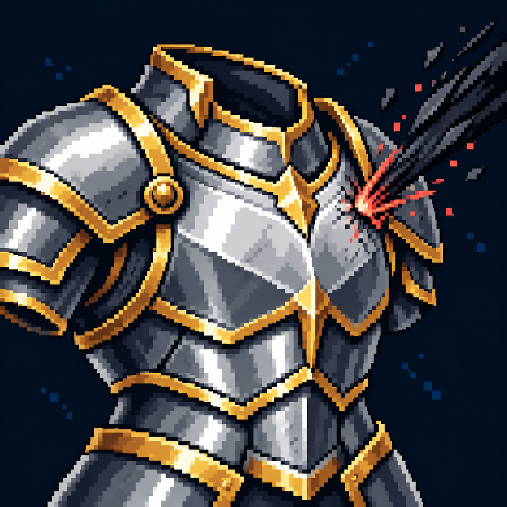

# Снижение входящего урона

Статус: **candidate**, художественный референс для проверки пользователем.

Усиленный нагрудник с небольшим следом принятого удара обозначает снижение урона.

Страница CubeSiege: [Снижение входящего урона](https://chatgpt.com/space/page_f42c321c1d088191b0b851e9c34abe29).

Происхождение и параметры: `provenance.json`; точный промпт: `prompt.txt`; наблюдения: `inspection.json`.
