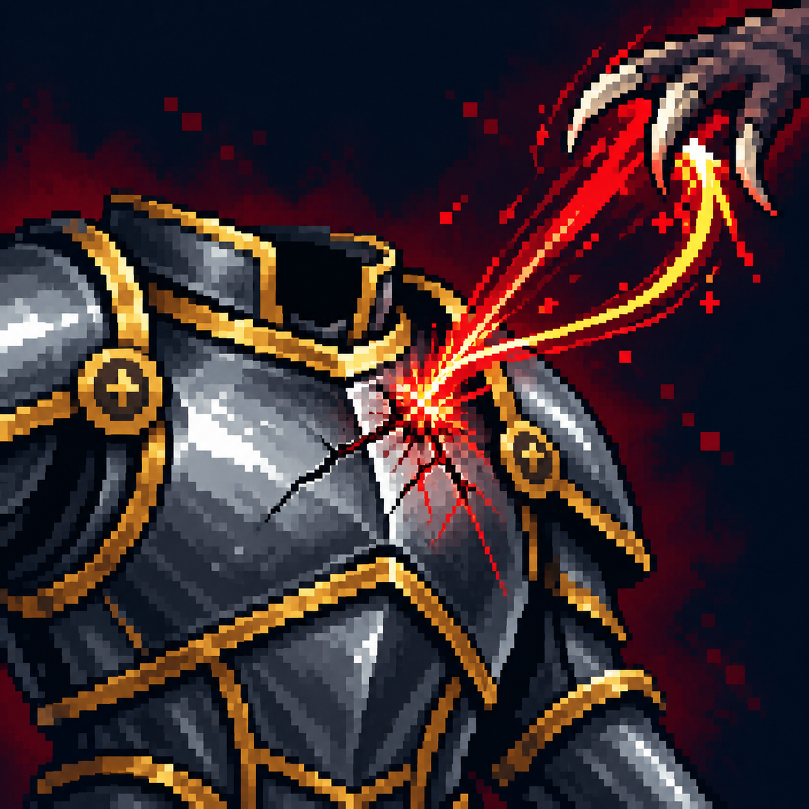

# Отражение урона

Статус: **candidate**, художественный референс для проверки пользователем.

Полученный удар оставляет след на броне, а ответная энергия возвращается к атакующему.

Страница CubeSiege: [Отражение урона](https://chatgpt.com/space/page_0a211a7c6ba48191b1639d1d474d22ff).

Происхождение и параметры: `provenance.json`; точный промпт: `prompt.txt`; наблюдения: `inspection.json`.
