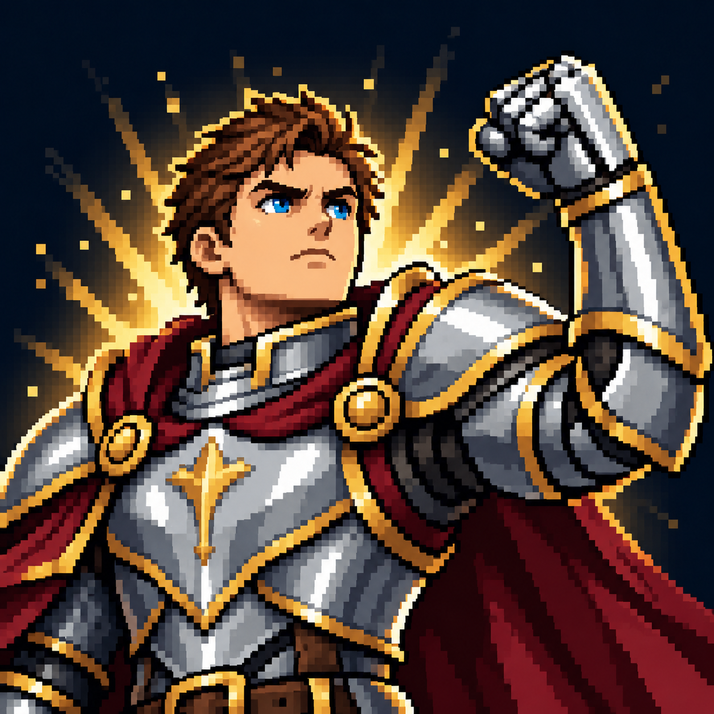

# Повышение морали?

Статус: **candidate**, художественный референс для проверки пользователем.

Поднятая перчатка и уверенная поза обозначают боевой дух без фиксации спорного состава бонусов. Визуальная трактовка существующего эффекта под вопросом; не утверждает его механику.

Страница CubeSiege: [Повышение морали?](https://chatgpt.com/space/page_6b580d3d14788191a9c994d2cc7e4a9a).

Происхождение и параметры: `provenance.json`; точный промпт: `prompt.txt`; наблюдения: `inspection.json`.
