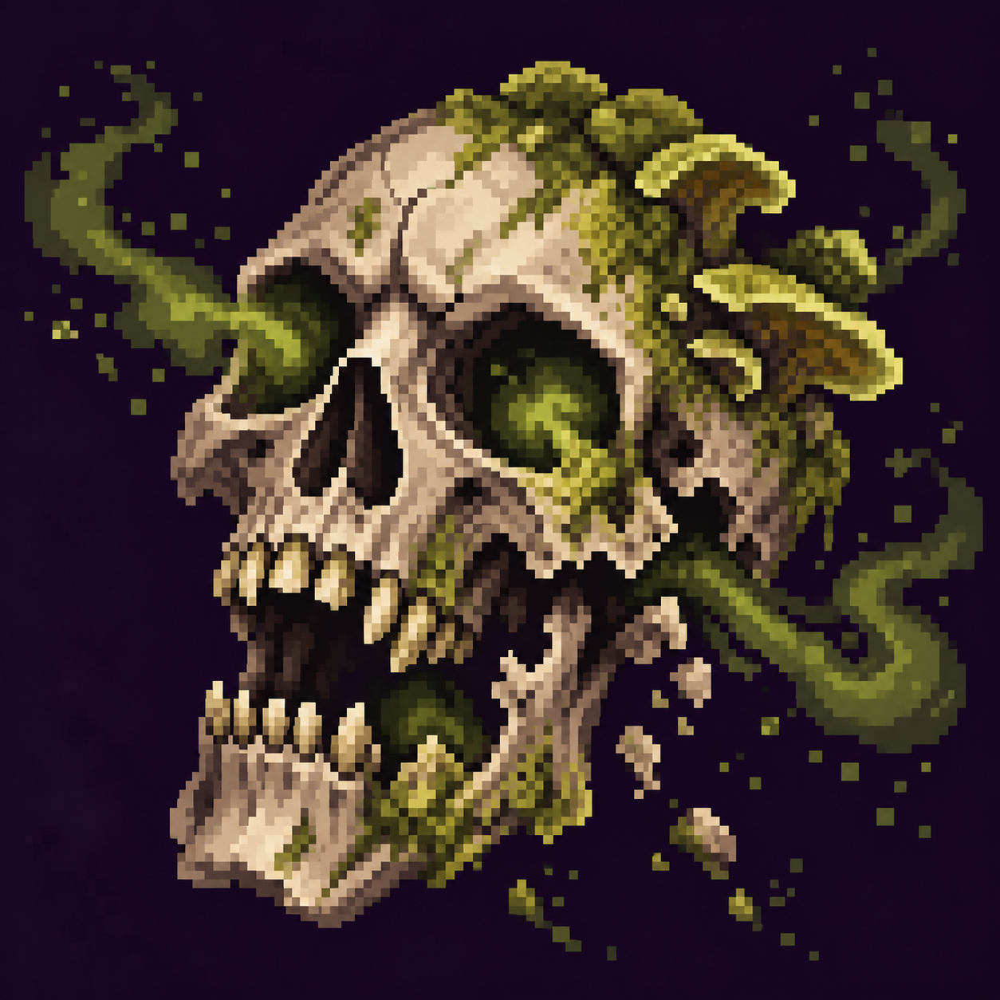

# Гниение

Статус: **candidate**, художественный референс для проверки пользователем.

Разрушающийся череп, грибковые пятна и мутные споры передают гниение.

Страница CubeSiege: [Гниение](https://chatgpt.com/space/page_d0f45e82cee881918dd8fd6cbe9aab83).

Происхождение и параметры: `provenance.json`; точный промпт: `prompt.txt`; наблюдения: `inspection.json`.
