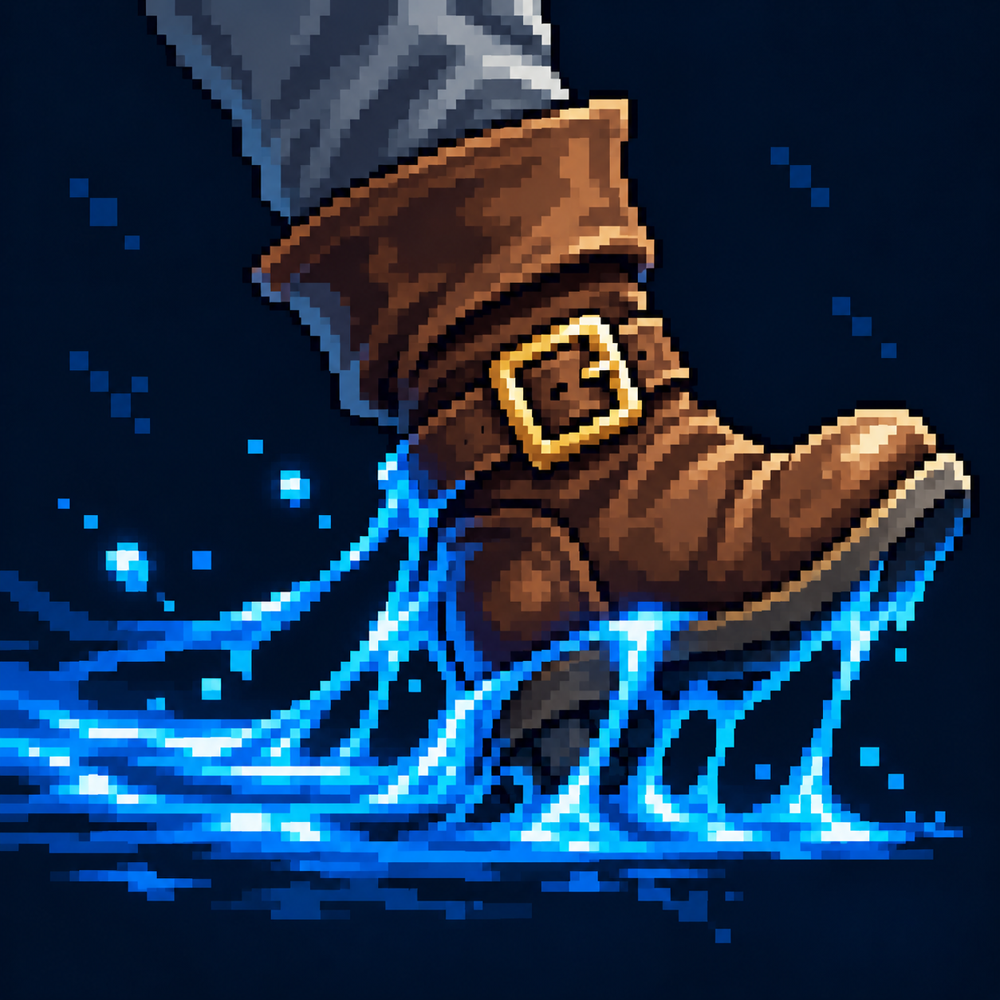

# Замедление

Статус: **candidate**, художественный референс для проверки пользователем.

Тяжёлый шаг и вязкий голубой след обозначают снижение скорости.

Страница CubeSiege: [Замедление](https://chatgpt.com/space/page_d010d9d01ff8819196094b29ad56e413).

Происхождение и параметры: `provenance.json`; точный промпт: `prompt.txt`; наблюдения: `inspection.json`.
