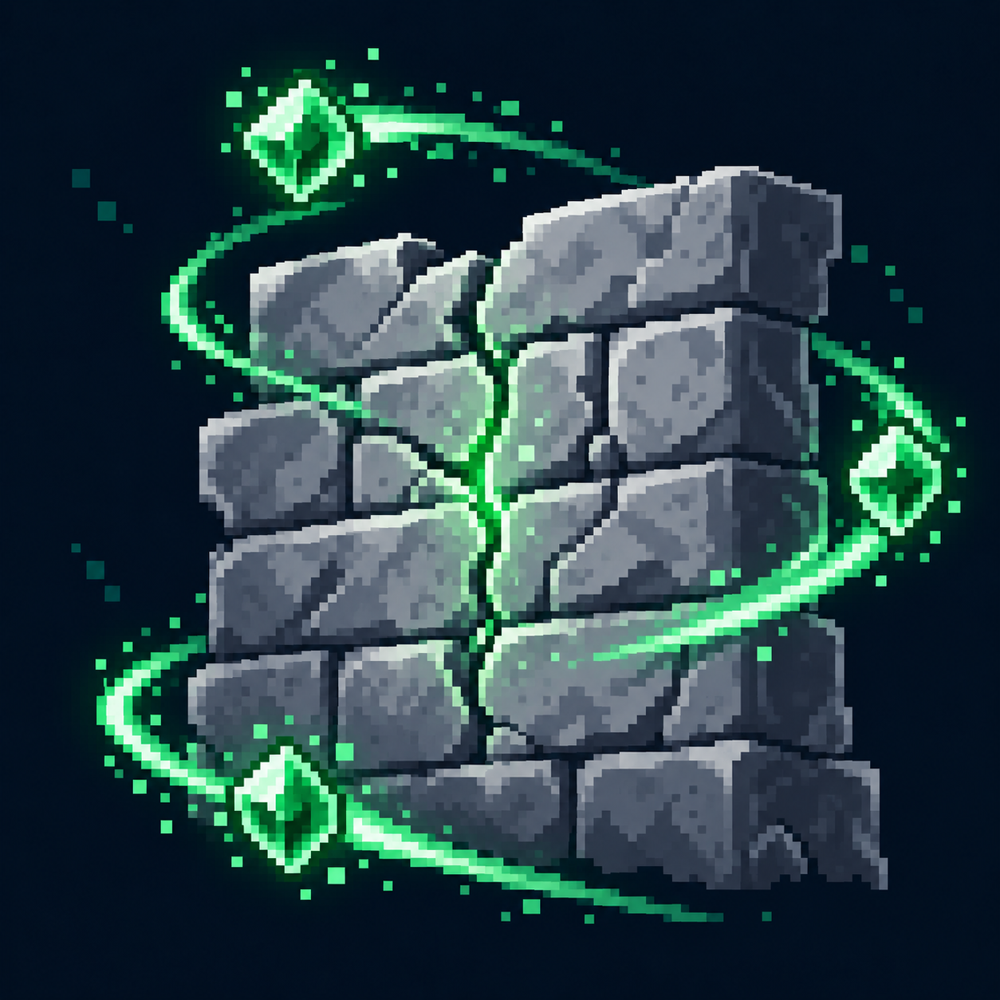

# Регенерация прочности?

Статус: **candidate**, художественный референс для проверки пользователем.

Продолжающееся восстановление кладки отличается от разового удара ремонтным молотом. Визуальная трактовка существующего эффекта под вопросом; не утверждает его механику.

Страница CubeSiege: [Регенерация прочности?](https://chatgpt.com/space/page_ef0d120419948191a7d201cb03dd3556).

Происхождение и параметры: `provenance.json`; точный промпт: `prompt.txt`; наблюдения: `inspection.json`.
