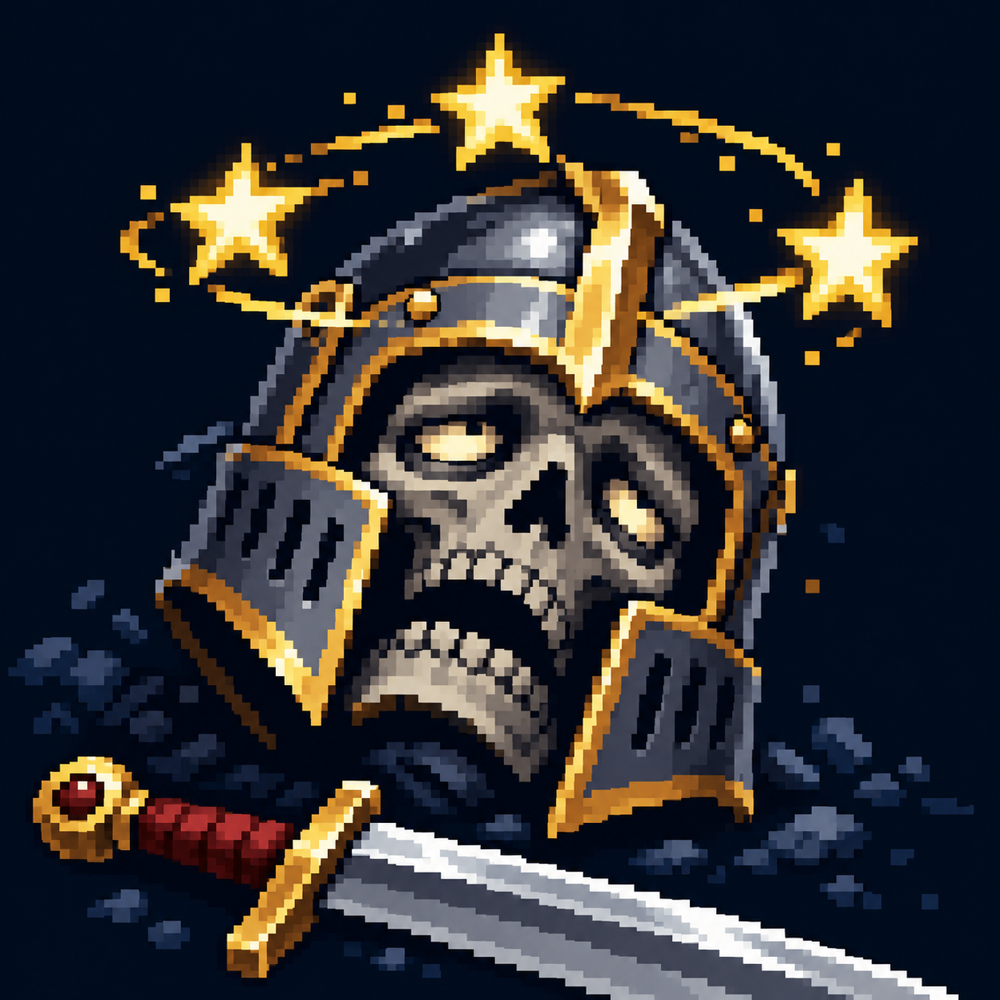

# Оглушение

Статус: **candidate**, художественный референс для проверки пользователем.

Звёзды над потерявшей ориентацию головой передают оглушение.

Страница CubeSiege: [Оглушение](https://chatgpt.com/space/page_45d20c1035a881919bc5b6625ba3c58e).

Происхождение и параметры: `provenance.json`; точный промпт: `prompt.txt`; наблюдения: `inspection.json`.
