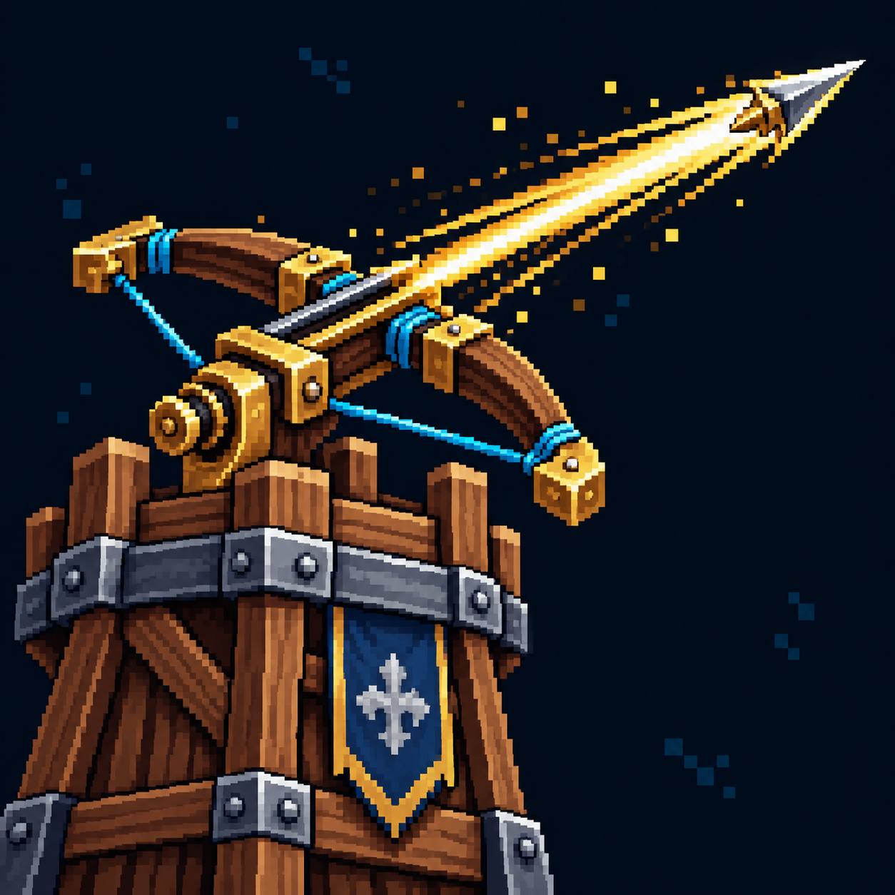

# Усиление башен?

Статус: **candidate**, художественный референс для проверки пользователем.

Башня и усиленный арбалетный выстрел; параметры дальности и частоты не изображены. Визуальная трактовка существующего эффекта под вопросом; не утверждает его механику.

Страница CubeSiege: [Усиление башен?](https://chatgpt.com/space/page_14f4dab53b408191bc8688e5fa203f53).

Происхождение и параметры: `provenance.json`; точный промпт: `prompt.txt`; наблюдения: `inspection.json`.
