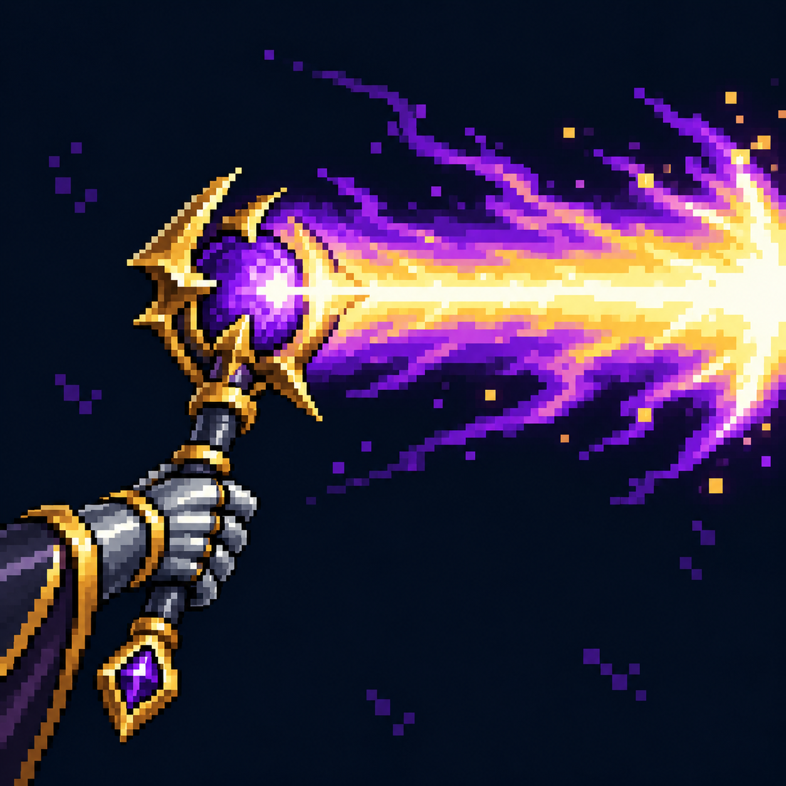

# Атака по линии

Статус: **candidate**, художественный референс для проверки пользователем.

Пиксельная иконка проверена на соответствие источнику, траектории и моменту действия способности.

Страница CubeSiege: [Атака по линии](https://chatgpt.com/space/page_c8b3c7dc5378819193fa8f4237c1a319).

Происхождение и параметры: `provenance.json`; точный промпт: `prompt.txt`; наблюдения: `inspection.json`.
