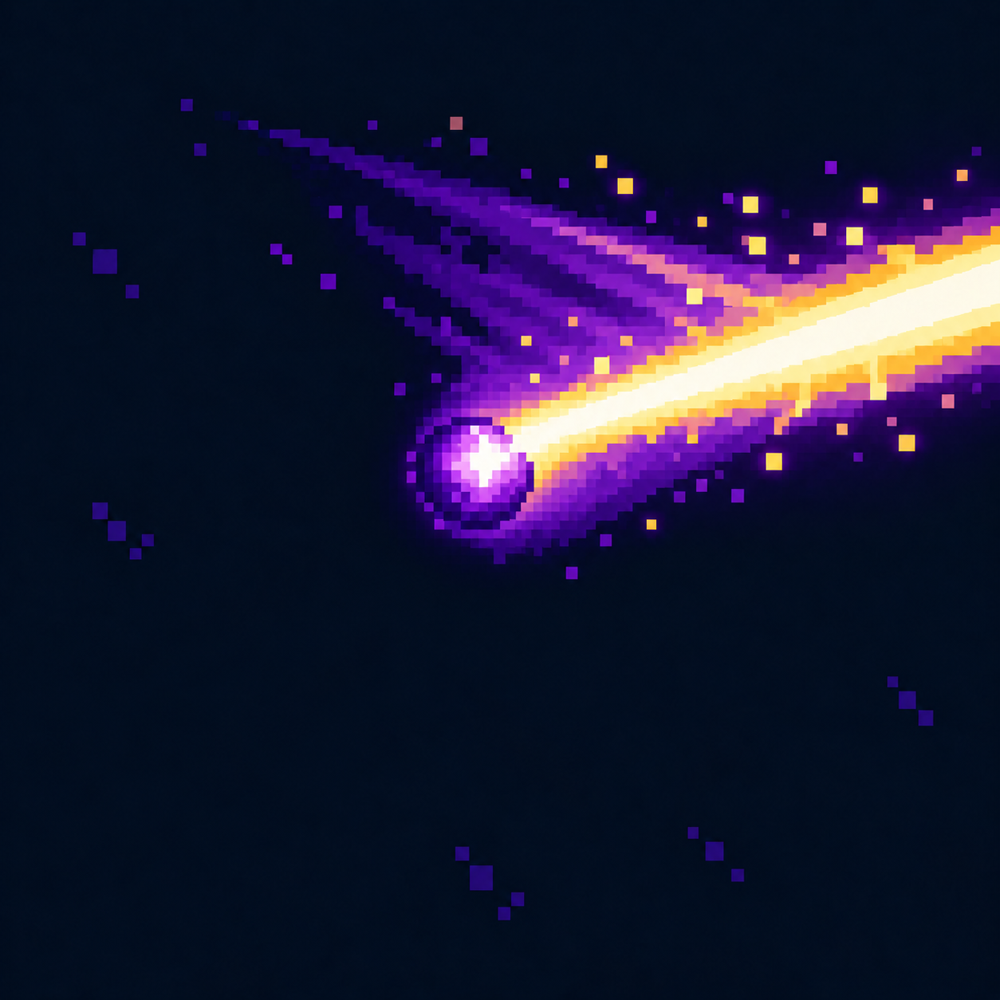

# Радиальная атака — Один луч: проход слева направо.

Статус: **candidate**, художественный референс для проверки пользователем.

Один луч: проход слева направо.

Страница CubeSiege: [Радиальная атака — Один луч: проход слева направо.](https://chatgpt.com/space/page_ce4118ce9c388191bd50b8243720e0ec).

Происхождение и параметры: `provenance.json`; точный промпт: `prompt.txt`; наблюдения: `inspection.json`.
