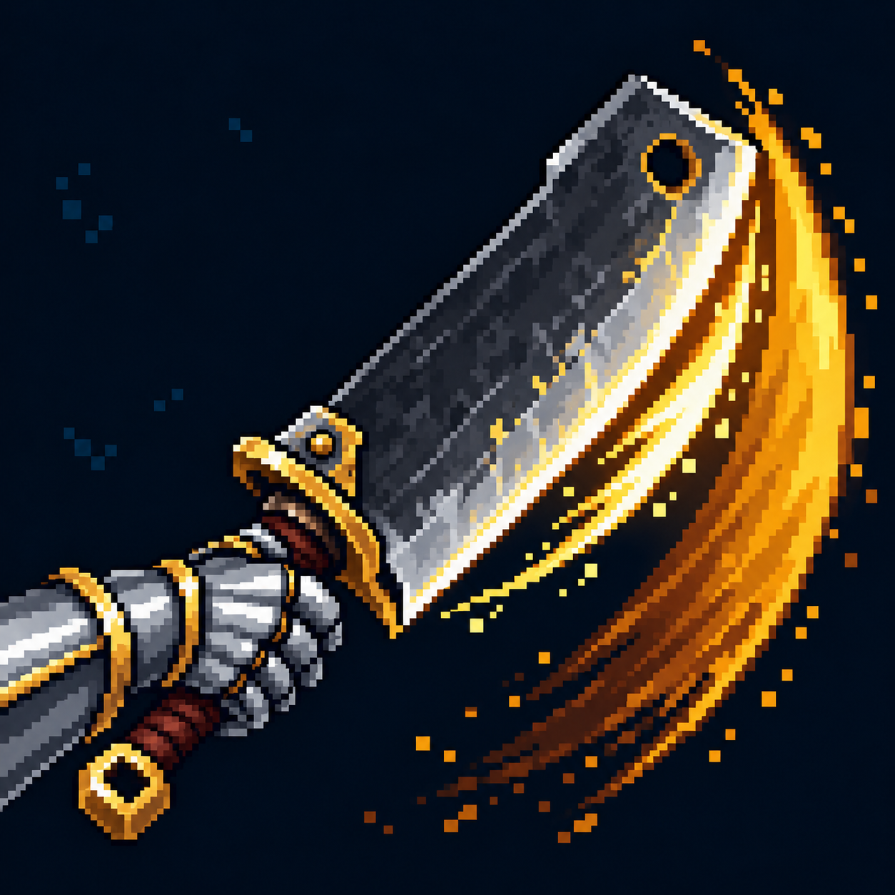

# Удар с обратным взмахом

Статус: **candidate**, художественный референс для проверки пользователем.

Пиксельная иконка проверена на соответствие источнику, траектории и моменту действия способности.

Страница CubeSiege: [Удар с обратным взмахом](https://chatgpt.com/space/page_95353da2b24c8191b3649aa6c0c34e62).

Происхождение и параметры: `provenance.json`; точный промпт: `prompt.txt`; наблюдения: `inspection.json`.
